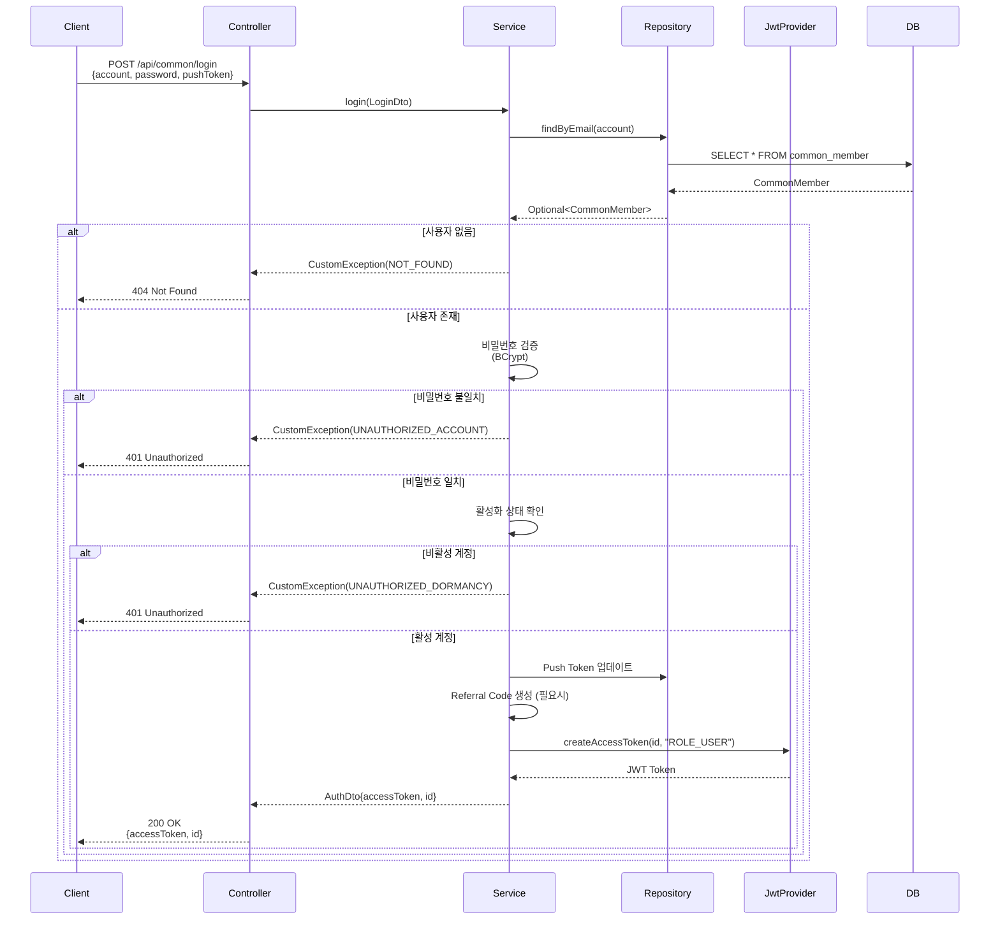
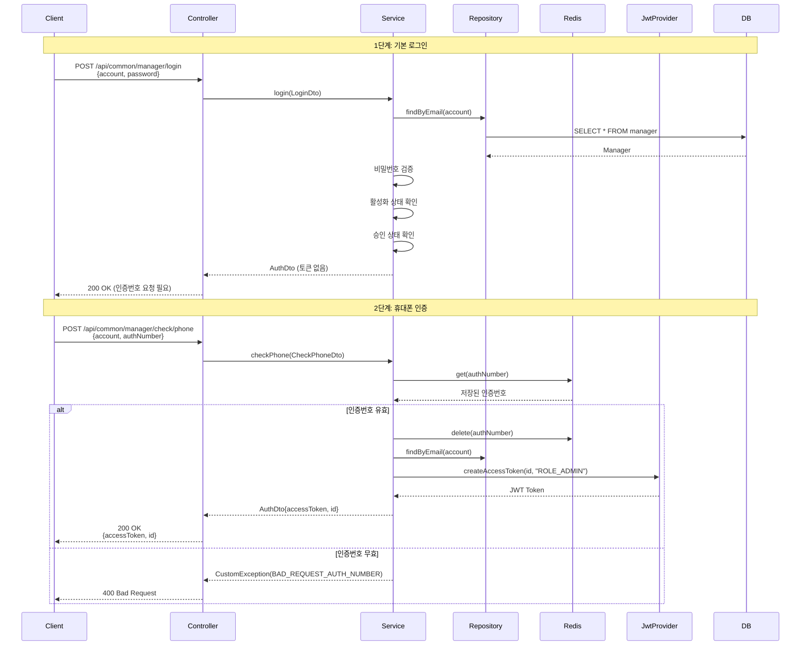
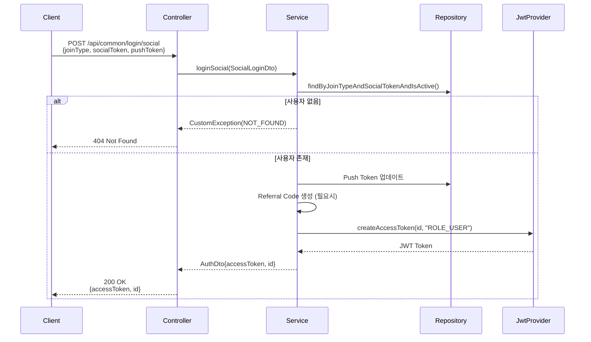
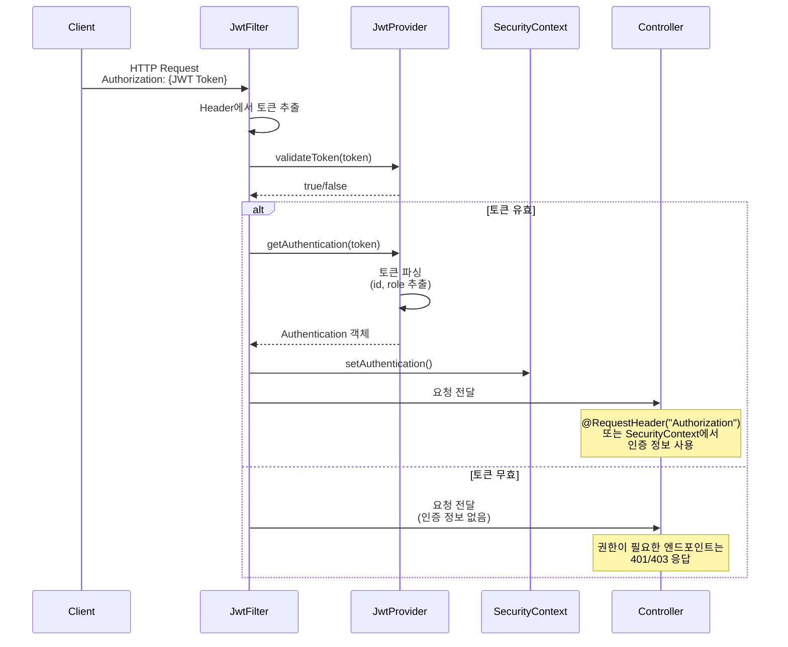

# Orange School API 서버 로그인 시스템 분석

## 개요
Orange School API 서버는 JWT(JSON Web Token) 기반의 인증 시스템을 사용하여 사용자와 관리자의 로그인을 처리합니다. Spring Security와 JWT를 조합하여 stateless한 인증 방식을 구현하고 있습니다.

## 주요 구성 요소

### 1. 인증 관련 설정
- **SecurityConfig**: Spring Security 설정을 담당
  - BCryptPasswordEncoder를 사용한 비밀번호 암호화
  - JWT 필터를 UsernamePasswordAuthenticationFilter 앞에 추가
  - CORS 설정 포함
  - 세션을 사용하지 않는 STATELESS 정책 적용

### 2. JWT 처리
- **JwtTokenProvider**: JWT 토큰 생성 및 검증
  - 액세스 토큰 유효기간: 6시간
  - 토큰에는 사용자 ID와 권한(role) 정보 포함
  - HS256 알고리즘 사용

- **JwtAuthenticationFilter**: HTTP 요청에서 JWT 토큰 추출 및 인증
  - Authorization 헤더에서 토큰 추출
  - 토큰 유효성 검증 후 SecurityContext에 인증 정보 설정

### 3. 로그인 엔드포인트

#### 일반 사용자 로그인
- **엔드포인트**: `POST /api/common/login`
- **컨트롤러**: CommonMemberController
- **서비스**: CommonMemberService

#### 관리자 로그인
- **엔드포인트**: `POST /api/common/manager/login`
- **추가 인증**: `POST /api/common/manager/check/phone` (휴대폰 인증)
- **컨트롤러**: ManagerController
- **서비스**: ManagerService

#### 소셜 로그인
- **엔드포인트**: `POST /api/common/login/social`
- **지원 플랫폼**: 카카오 등 (JoinType enum으로 관리)

## 로그인 프로세스

### 1. 일반 사용자 로그인 프로세스



### 2. 관리자 로그인 프로세스 (2단계 인증)



### 3. 소셜 로그인 프로세스



## 인증된 요청 처리 과정



## 주요 특징

### 1. 보안 특징
- **비밀번호 암호화**: BCrypt 사용
- **토큰 기반 인증**: 세션을 사용하지 않는 Stateless 방식
- **역할 기반 접근 제어**: USER, ADMIN 권한 구분
- **2단계 인증**: 관리자는 비밀번호 + 휴대폰 인증 필요

### 2. 토큰 관리
- **액세스 토큰만 사용**: 리프레시 토큰은 현재 구현되지 않음
- **토큰 유효기간**: 6시간
- **토큰 저장 정보**: 사용자 ID, 권한(role)

### 3. 추가 기능
- **Push Token 관리**: 로그인 시 FCM push token 업데이트
- **중복 Push Token 방지**: 다른 계정의 동일한 push token 삭제
- **Referral Code**: 로그인 시 자동 생성 (없는 경우)
- **휴면 계정 처리**: isActive 플래그로 관리
- **관리자 승인**: isApproved 플래그로 관리 (관리자만)

## API 요청/응답 형식

### 로그인 요청
```json
{
  "account": "user@example.com",
  "password": "password123",
  "pushToken": "fcm_push_token" // 선택사항
}
```

### 로그인 응답
```json
{
  "message": "성공",
  "data": {
    "accessToken": "eyJhbGciOiJIUzI1NiJ9...",
    "id": 12345
  }
}
```

### 인증된 API 요청
```http
GET /api/user/commonMember
Authorization: eyJhbGciOiJIUzI1NiJ9...
```

## 에러 처리

| 에러 코드 | 설명 | HTTP 상태 |
|----------|------|-----------|
| NOT_FOUND | 사용자를 찾을 수 없음 | 404 |
| UNAUTHORIZED_ACCOUNT | 비밀번호 불일치 | 401 |
| UNAUTHORIZED_DORMANCY | 휴면 계정 | 401 |
| UNAUTHORIZED_APPROVE | 미승인 관리자 | 401 |
| BAD_REQUEST_AUTH_NUMBER | 잘못된 인증번호 | 400 |
| FORBIDDEN_INVALID_TOKEN | 유효하지 않은 토큰 | 403 |

## 개선 제안사항

1. **리프레시 토큰 구현**: 현재 주석 처리된 리프레시 토큰 기능 활성화 고려
2. **토큰 블랙리스트**: 로그아웃 시 토큰 무효화 기능 추가
3. **로그인 시도 제한**: 무차별 대입 공격 방지
4. **토큰 갱신 메커니즘**: 액세스 토큰 만료 전 자동 갱신
5. **감사 로그**: 로그인/로그아웃 이벤트 기록