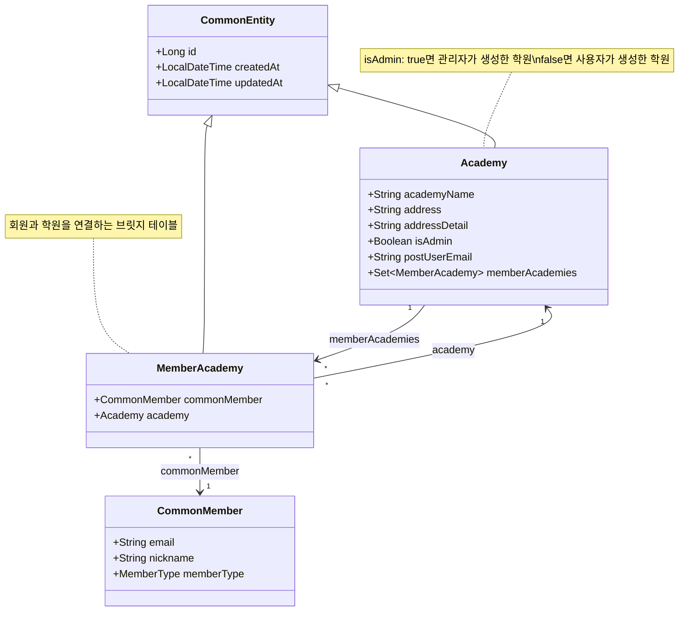
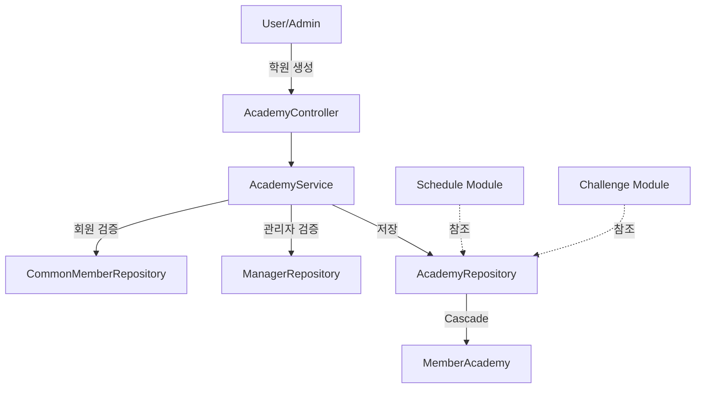
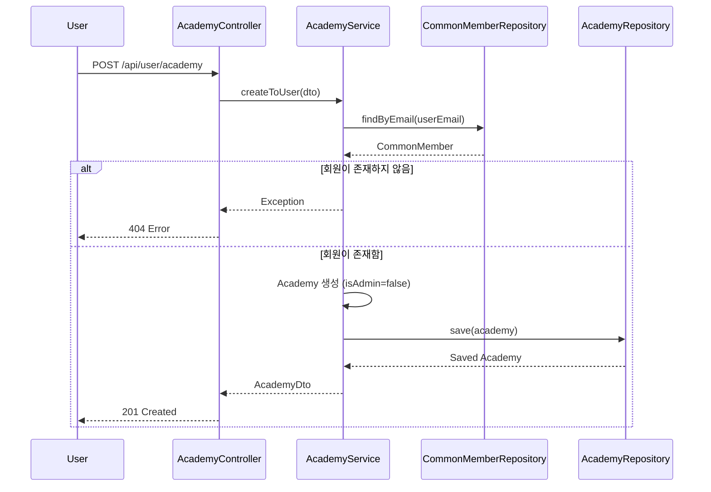
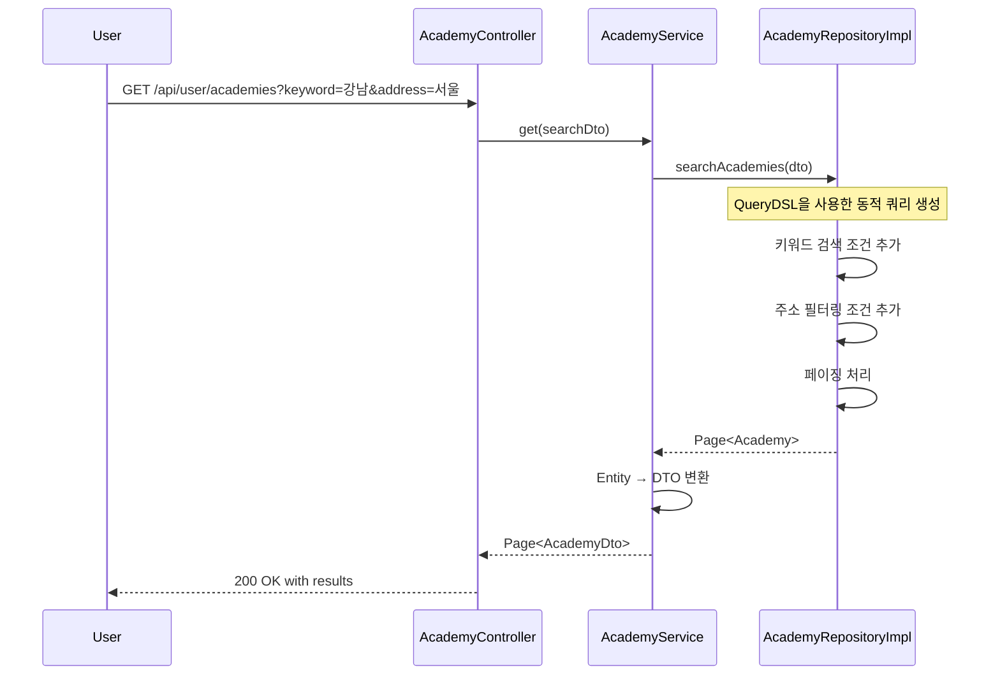

# Academy 모듈 분석

## 1. 모듈이 담당하는 역할

Academy 모듈은 교육 기관(학원)을 관리하는 핵심 모듈입니다. 주요 기능은 다음과 같습니다:

- 학원 정보 생성 및 관리 (이름, 주소 등)
- 사용자/관리자별 차별화된 학원 생성 권한
- 회원과 학원 간의 다대다 관계 관리
- 지역별 학원 검색 및 필터링
- 학원 정보의 CRUD 작업

## 2. 도메인 객체 구조도



## 3. 모듈 연관성 분석

### 직접 의존 모듈
- **CommonMember**: 학원과 회원 간의 관계 설정
- **Manager**: 관리자 권한으로 학원 생성 시 검증
- **MemberAcademy**: 회원-학원 연결 관리

### 간접 연관 모듈
- **Schedule**: 학원별 일정 관리 시 Academy 참조
- **Challenge**: 학원 내 챌린지 활동
- **Alarm**: 학원 관련 알림 발송

### 데이터 흐름


## 4. 서비스에서 하는 일과 시퀀스 다이어그램

### 주요 서비스 메소드

1. **createToUser()**: 일반 사용자의 학원 생성
2. **create()**: 관리자의 학원 생성
3. **get()**: 학원 목록 조회 (검색/필터링)
4. **put()**: 학원 정보 수정
5. **delete()**: 학원 삭제

### 학원 생성 시퀀스 다이어그램 (사용자)



### 학원 검색 시퀀스 다이어그램



## 5. 개선점

### 1. **회원-학원 연결 기능 완성**
- 현재 MemberAcademyService의 create/update/delete 메소드가 주석 처리됨
- 회원을 학원에 등록하는 명시적인 API 엔드포인트 필요

### 2. **중복 검증 추가**
```java
// 학원 생성 시 중복 체크 로직 추가 필요
if (academyRepository.existsByAcademyNameAndAddress(dto.getAcademyName(), dto.getAddress())) {
    throw new CustomException(ResponseCode.ACADEMY_ALREADY_EXISTS);
}
```

### 3. **트랜잭션 관리 강화**
```java
@Transactional
public AcademyDto create(CreateAcademyDto dto) {
    // 트랜잭션 어노테이션 추가로 데이터 일관성 보장
}
```

### 4. **주소 검색 개선**
- 현재 '#' 구분자를 사용한 주소 검색은 사용자에게 불편할 수 있음
- 더 직관적인 검색 방식 고려 (예: 별도의 지역 필터 파라미터)

### 5. **권한 검증 강화**
```java
// 학원 수정/삭제 시 권한 검증 추가
public void validateAcademyOwnership(Long academyId, String userEmail) {
    Academy academy = academyRepository.findById(academyId)
        .orElseThrow(() -> new CustomException(ResponseCode.ACADEMY_NOT_FOUND));
    
    if (!academy.getPostUserEmail().equals(userEmail) && !isAdmin(userEmail)) {
        throw new CustomException(ResponseCode.UNAUTHORIZED);
    }
}
```

### 6. **캐싱 전략 도입**
- 자주 조회되는 학원 정보에 대한 캐싱 고려
- Redis를 활용한 검색 결과 캐싱

### 7. **벌크 연산 최적화**
- deleteAll 메소드에서 각 엔티티를 개별 삭제하는 대신 벌크 삭제 쿼리 사용

### 8. **API 문서화 개선**
- Swagger 어노테이션 추가로 API 명세 자동화
- 요청/응답 예시 추가

### 9. **검색 성능 최적화**
- 학원명과 주소에 대한 인덱스 추가
- Full-text search 도입 고려

### 10. **학원 통계 기능 추가**
- 학원별 회원 수, 활동 통계 등의 분석 기능 추가
- 대시보드를 위한 집계 API 제공