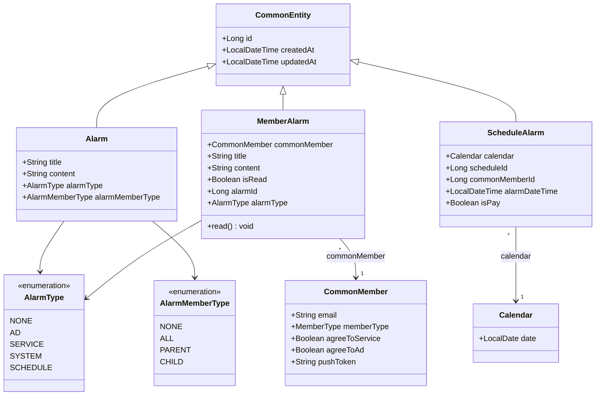
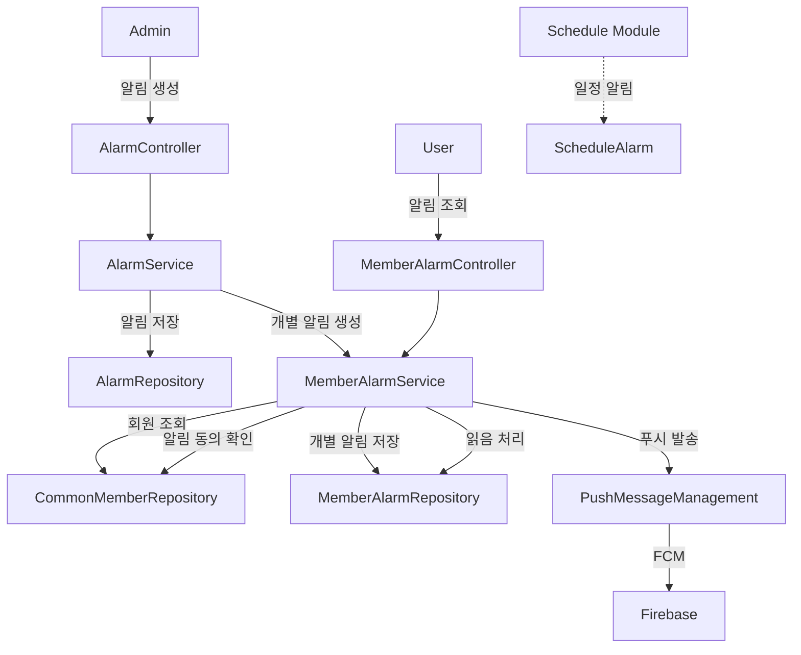
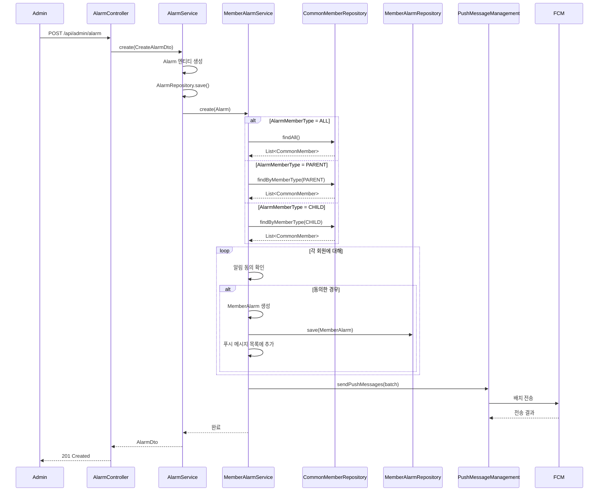
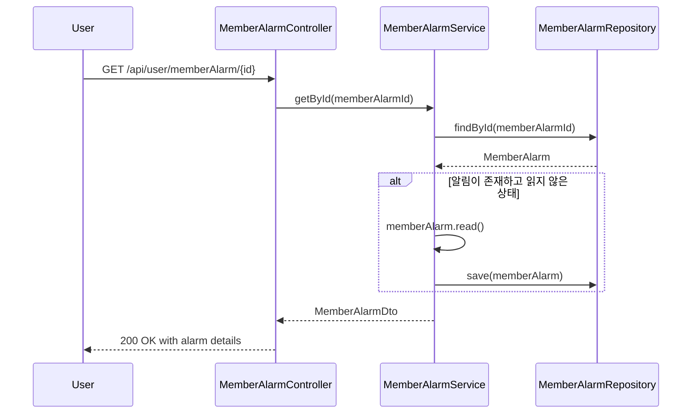

# Alarm 모듈 분석

## 1. 모듈이 담당하는 역할

Alarm 모듈은 오렌지스쿨 플랫폼의 알림 시스템을 담당하는 핵심 모듈입니다. 주요 기능은 다음과 같습니다:

- 광고성, 서비스, 시스템, 일정 알림 생성 및 관리
- 부모/자녀별 타겟팅된 알림 발송
- Firebase Cloud Messaging을 통한 푸시 알림 전송
- 개인별 알림 읽음 상태 관리
- 사용자 알림 동의 설정에 따른 선택적 알림 발송

## 2. 도메인 객체 구조도



## 3. 모듈 연관성 분석

### 직접 의존 모듈
- **CommonMember**: 알림 수신자 정보 및 알림 동의 설정
- **Calendar**: 일정 기반 알림을 위한 날짜 관리
- **PushMessageManagement**: FCM 푸시 알림 전송

### 간접 연관 모듈
- **Schedule**: 일정 알림 생성 시 참조
- **Challenge**: 챌린지 관련 알림 발송
- **Story/Pick**: 컨텐츠 상호작용 알림
- **Payment**: 결제 관련 알림

### 데이터 흐름


## 4. 서비스에서 하는 일과 시퀀스 다이어그램

### 주요 서비스 메소드

#### AlarmService
1. **create()**: 관리자 알림 생성 및 회원별 알림 분배
2. **get()**: 알림 목록 조회 (페이징, 필터링)
3. **delete()**: 알림 삭제

#### MemberAlarmService
1. **create()**: 회원별 개별 알림 생성 및 푸시 발송
2. **createToSystem()**: 시스템 알림 개별 생성
3. **getById()**: 알림 조회 및 읽음 처리
4. **getNewExist()**: 읽지 않은 알림 존재 여부 확인

### 알림 생성 시퀀스 다이어그램



### 알림 조회 및 읽음 처리 시퀀스 다이어그램



## 5. 개선점

### 1. **데이터 중복 제거**
```java
// 현재: MemberAlarm에 title, content 중복 저장
// 개선안: Alarm 엔티티 참조 방식으로 변경
@Entity
public class MemberAlarm extends CommonEntity {
    @ManyToOne(fetch = FetchType.LAZY)
    @JoinColumn(name = "alarmId")
    private Alarm alarm;  // alarmId 대신 직접 참조
    
    @ManyToOne(fetch = FetchType.LAZY)
    private CommonMember commonMember;
    
    private Boolean isRead = false;
}
```

### 2. **알림 수정 기능 추가**
```java
@PutMapping("/alarm/{alarmId}")
public ResponseDto<AlarmDto> update(
    @PathVariable Long alarmId,
    @RequestBody UpdateAlarmDto dto
) {
    return ResponseDto.ok(alarmService.update(alarmId, dto));
}
```

### 3. **Cascade 삭제 관계 설정**
```java
@Entity
public class Alarm extends CommonEntity {
    @OneToMany(mappedBy = "alarm", cascade = CascadeType.REMOVE)
    private List<MemberAlarm> memberAlarms = new ArrayList<>();
}
```

### 4. **알림 만료 기능 구현**
```java
@Scheduled(cron = "0 0 2 * * *")  // 매일 새벽 2시
public void cleanupExpiredAlarms() {
    LocalDateTime expirationDate = LocalDateTime.now().minusMonths(3);
    memberAlarmRepository.deleteByCreatedAtBefore(expirationDate);
}
```

### 5. **타입 안전성 버그 수정**
```java
// AlarmRepositoryImpl.java line 84
// 현재 코드
if (alarmMemberType == null || alarmMemberType == alarmMemberType.NONE) {

// 수정된 코드
if (alarmMemberType == null || alarmMemberType == AlarmMemberType.NONE) {
```

### 6. **ALL 타입 알림의 이력 보존**
```java
// 현재는 ALL 타입일 때 MemberAlarm을 생성하지 않음
// 개선안: 모든 알림에 대해 이력 보존
if (alarm.getAlarmMemberType() == AlarmMemberType.ALL) {
    commonMembers.forEach(member -> {
        if (shouldReceiveAlarm(member, alarm.getAlarmType())) {
            createAndSaveMemberAlarm(member, alarm);
        }
    });
}
```

### 7. **검색 기능 강화**
```java
public class AlarmFilterDto {
    private String keyword;
    private AlarmType alarmType;
    private AlarmMemberType alarmMemberType;
    private LocalDateTime startDate;
    private LocalDateTime endDate;
}
```

### 8. **배치 처리 최적화**
```java
// 대량 알림 생성 시 배치 인서트 사용
@Modifying
@Query("INSERT INTO MemberAlarm (commonMember, alarm, isRead) " +
       "SELECT m, :alarm, false FROM CommonMember m WHERE m.id IN :memberIds")
void batchCreateMemberAlarms(@Param("alarm") Alarm alarm, @Param("memberIds") List<Long> memberIds);
```

### 9. **알림 통계 기능 추가**
```java
public class AlarmStatisticsDto {
    private Long totalSent;
    private Long totalRead;
    private Double readRate;
    private Map<AlarmType, Long> countByType;
}
```

### 10. **WebSocket 실시간 알림**
```java
@MessageMapping("/alarm")
@SendTo("/topic/alarm/{userId}")
public MemberAlarmDto sendRealTimeAlarm(
    @DestinationVariable String userId,
    MemberAlarmDto alarm
) {
    return alarm;
}
```