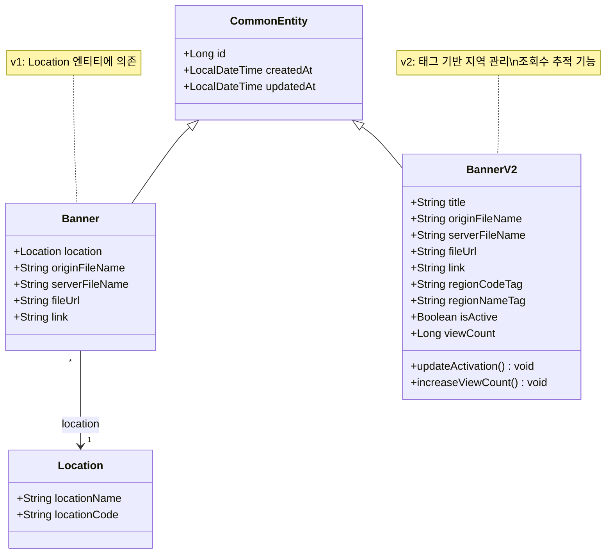
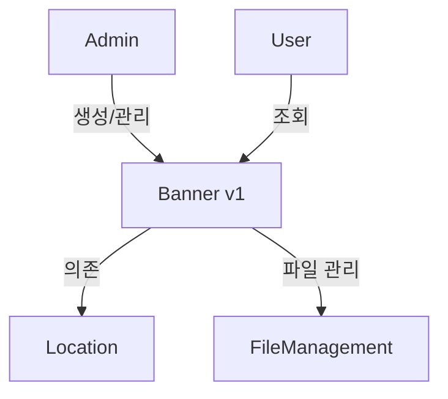
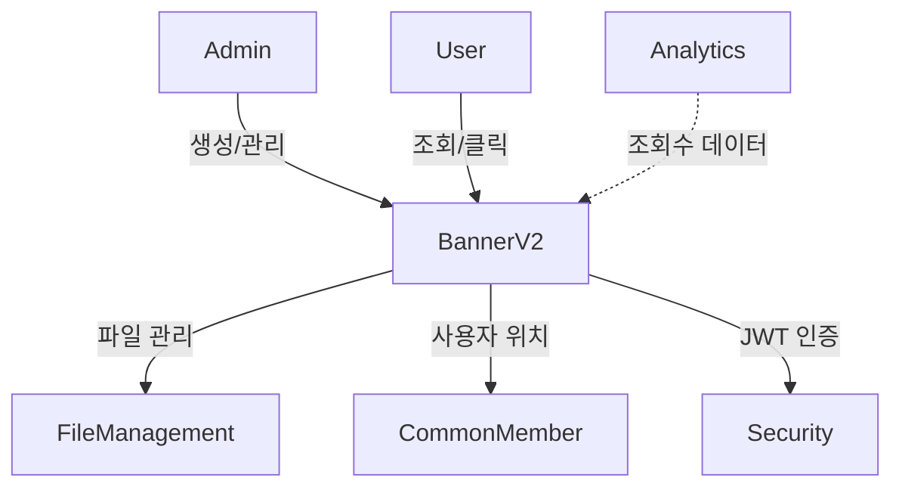
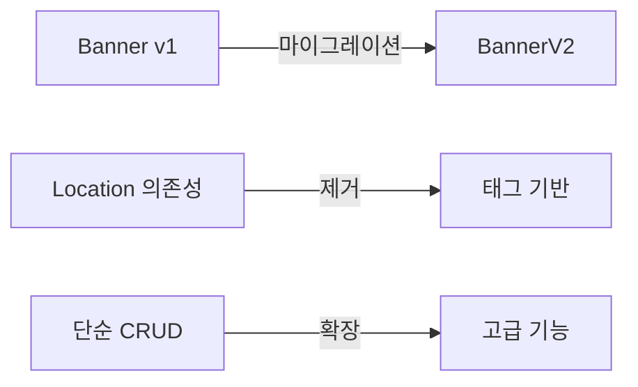
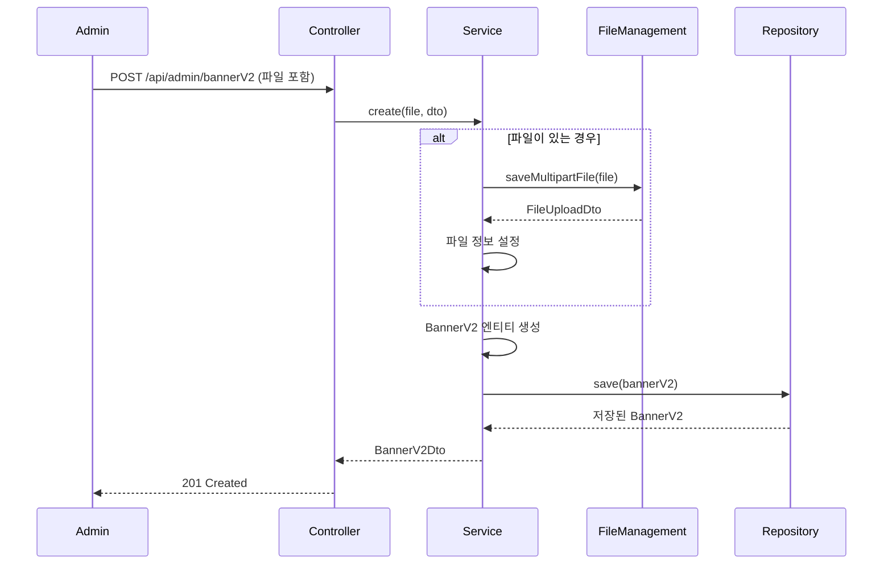
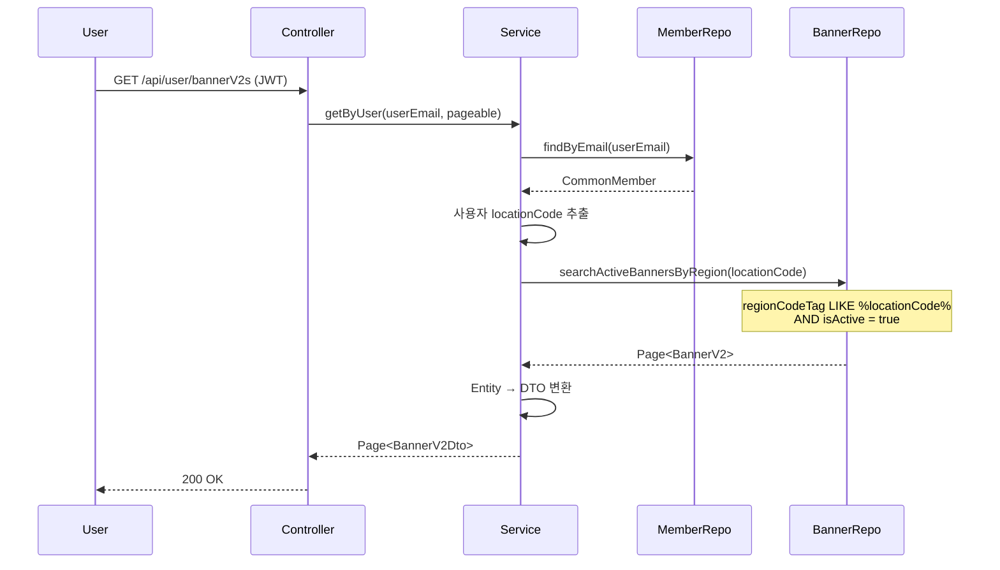
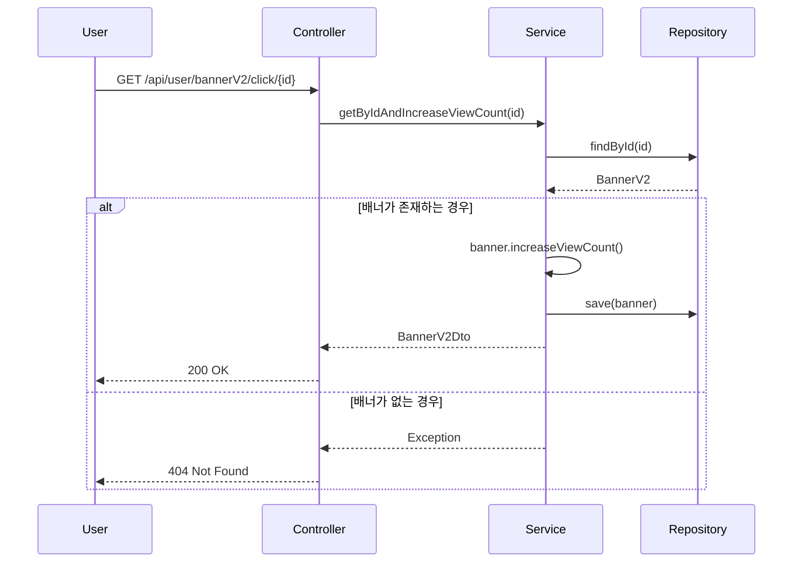

# Banner 모듈 분석

## 1. 모듈이 담당하는 역할

Banner 모듈은 오렌지스쿨 플랫폼의 배너 광고 시스템을 담당합니다. 두 가지 버전이 공존하며, 각각의 주요 기능은 다음과 같습니다:

### Banner (v1)
- 위치(Location) 기반 배너 관리
- 단순한 이미지 배너와 링크 관리
- 지역별 배너 표시

### BannerV2
- 태그 기반의 유연한 지역 타겟팅
- 배너 조회수 추적
- 활성화/비활성화 상태 관리
- 키워드 검색 및 페이징 지원
- 사용자 맞춤형 배너 제공

## 2. 도메인 객체 구조도



## 3. 모듈 연관성 분석

### Banner (v1) 연관성


### BannerV2 연관성


### 모듈 진화


## 4. 서비스에서 하는 일과 시퀀스 다이어그램

### 주요 서비스 메소드

#### BannerService (v1)
1. **create()**: 위치별 배너 생성
2. **get()**: 위치 기반 배너 조회
3. **update()**: 배너 정보 수정
4. **delete()**: 배너 삭제

#### BannerV2Service
1. **create()**: 태그 기반 배너 생성
2. **get()**: 페이징/검색 지원 배너 목록
3. **getByUser()**: 사용자 위치 기반 배너 필터링
4. **getByIdAndIncreaseViewCount()**: 조회수 증가
5. **updateActivation()**: 활성화 상태 토글
6. **deleteAll()**: 일괄 삭제

### BannerV2 생성 시퀀스 다이어그램



### 사용자별 배너 조회 시퀀스 다이어그램



### 배너 클릭 및 조회수 증가



## 5. 개선점

### 1. **v1 → v2 마이그레이션 완료**
```java
// 마이그레이션 스크립트 예시
@Transactional
public void migrateBannersToV2() {
    List<Banner> v1Banners = bannerRepository.findAll();
    
    v1Banners.forEach(banner -> {
        BannerV2 v2Banner = BannerV2.builder()
            .title(banner.getLocation().getLocationName() + " 배너")
            .regionCodeTag("#" + banner.getLocation().getLocationCode())
            .regionNameTag("#" + banner.getLocation().getLocationName())
            .fileUrl(banner.getFileUrl())
            .link(banner.getLink())
            .isActive(true)
            .viewCount(0L)
            .build();
        
        bannerV2Repository.save(v2Banner);
    });
}
```

### 2. **배너 성능 지표 확장**
```java
@Entity
public class BannerV2 extends CommonEntity {
    // 기존 필드...
    
    @Column
    private Long clickCount = 0L;  // 클릭 수
    
    @Column
    private LocalDateTime startDate;  // 게시 시작일
    
    @Column
    private LocalDateTime endDate;    // 게시 종료일
    
    public Double getClickThroughRate() {
        return viewCount > 0 ? (double) clickCount / viewCount * 100 : 0;
    }
}
```

### 3. **캐싱 전략 도입**
```java
@Cacheable(value = "activeUserBanners", key = "#locationCode")
public List<BannerV2Dto> getActiveUserBanners(String locationCode) {
    return bannerV2Repository.findActiveByLocationCode(locationCode);
}
```

### 4. **배너 우선순위 기능**
```java
@Entity
public class BannerV2 extends CommonEntity {
    @Column
    private Integer priority = 0;  // 높을수록 우선 표시
    
    @Column
    private BannerType type;  // MAIN, SUB, EVENT 등
}
```

### 5. **A/B 테스트 지원**
```java
public class BannerV2Dto {
    private String testGroup;  // A, B 그룹 구분
    private Map<String, Object> testMetrics;  // 테스트 관련 지표
}
```

### 6. **배너 스케줄링**
```java
@Scheduled(cron = "0 0 * * * *")  // 매시간
public void updateBannerStatus() {
    LocalDateTime now = LocalDateTime.now();
    
    // 시작일이 된 배너 활성화
    bannerV2Repository.activateBanners(now);
    
    // 종료일이 지난 배너 비활성화
    bannerV2Repository.deactivateBanners(now);
}
```

### 7. **이미지 최적화**
```java
@Service
public class BannerImageOptimizer {
    public FileUploadDto optimizeAndSave(MultipartFile file) {
        // 이미지 리사이징
        BufferedImage resized = resizeImage(file, 1200, 400);
        
        // WebP 포맷 변환
        byte[] webpImage = convertToWebP(resized);
        
        // CDN 업로드
        return uploadToCDN(webpImage);
    }
}
```

### 8. **배너 노출 제한**
```java
@Service
public class BannerFrequencyService {
    public List<BannerV2Dto> getFilteredBanners(String userId) {
        // Redis에서 사용자별 노출 이력 조회
        Set<Long> recentlyShown = getRecentlyShownBanners(userId);
        
        // 일정 기간 내 노출된 배너 제외
        return bannerV2Repository.findExcluding(recentlyShown);
    }
}
```

### 9. **배너 타겟팅 고도화**
```java
public class BannerTargeting {
    private Set<String> regionCodes;
    private Set<MemberType> memberTypes;  // PARENT, CHILD
    private Set<String> interests;         // 관심사 기반
    private Integer minAge;
    private Integer maxAge;
}
```

### 10. **v1 Deprecation 전략**
```java
@RestController
@Deprecated(since = "2.0", forRemoval = true)
@RequestMapping("/api/admin/banner")
public class BannerController {
    // v1 엔드포인트에 deprecation 경고 추가
    
    @GetMapping
    public ResponseDto<?> get() {
        log.warn("Banner v1 API is deprecated. Please migrate to v2.");
        // 응답 헤더에 deprecation 정보 추가
        return ResponseDto.ok("This API is deprecated");
    }
}
```