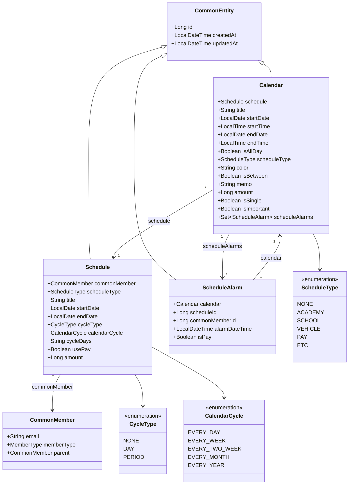
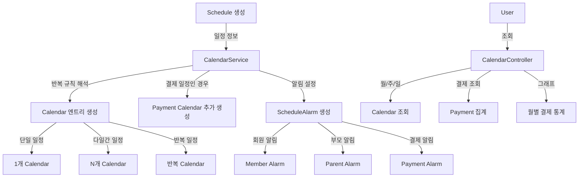
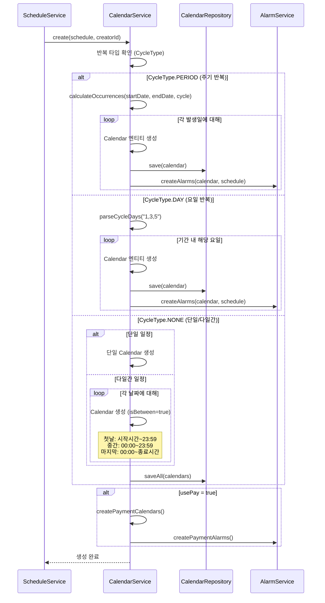
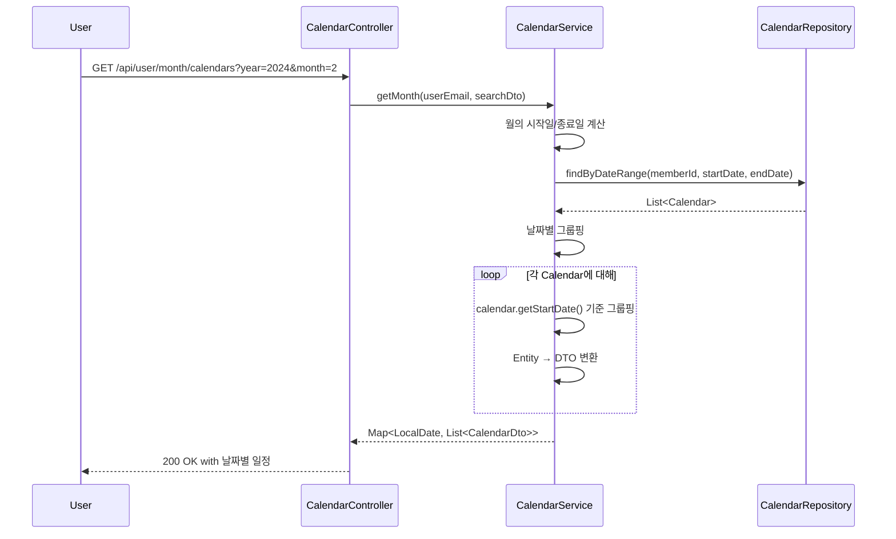
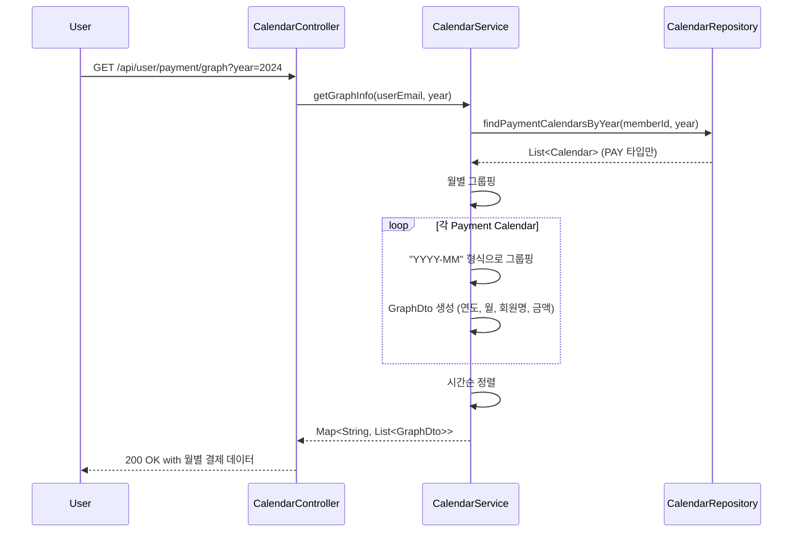

# Calendar 모듈 분석

## 1. 모듈이 담당하는 역할

Calendar 모듈은 오렌지스쿨 플랫폼의 일정 관리 시스템의 핵심으로, 다음과 같은 기능을 담당합니다:

- Schedule 엔티티를 기반으로 실제 캘린더 이벤트 생성
- 단일, 반복, 다일간 일정의 캘린더 엔트리 관리
- 월/주/일별 일정 조회 및 시간표 제공
- 결제 일정 관리 및 금액 집계
- 일정별 알림 설정 및 관리
- 결제 추이 그래프용 데이터 제공

## 2. 도메인 객체 구조도



## 3. 모듈 연관성 분석

### 직접 의존 모듈
- **Schedule**: 일정의 원본 데이터 제공
- **ScheduleAlarm**: 캘린더별 알림 관리
- **CommonMember**: 일정 소유자 및 알림 대상자 정보

### 모듈 간 데이터 흐름


## 4. 서비스에서 하는 일과 시퀀스 다이어그램

### 주요 서비스 메소드

1. **create()**: Schedule 기반 Calendar 생성 (복잡한 비즈니스 로직)
2. **createPayment()**: 결제 전용 Calendar 생성
3. **getMonth()**: 월별 캘린더 조회 (날짜별 그룹핑)
4. **getPayment()**: 결제 일정 조회 및 합계 계산
5. **getGraphInfo()**: 월별 결제 통계 데이터 생성

### 반복 일정 생성 시퀀스 다이어그램



### 월별 캘린더 조회 시퀀스 다이어그램



### 결제 그래프 데이터 생성



## 5. 개선점

### 1. **성능 최적화**
```java
// 현재: 개별 save 호출
calendars.forEach(calendar -> calendarRepository.save(calendar));

// 개선: 배치 저장
calendarRepository.saveAll(calendars);
```

### 2. **복잡한 로직 리팩토링**
```java
// Strategy Pattern 적용
public interface CalendarCreationStrategy {
    List<Calendar> createCalendars(Schedule schedule);
}

@Component
public class NoneCycleStrategy implements CalendarCreationStrategy { }

@Component
public class DayCycleStrategy implements CalendarCreationStrategy { }

@Component  
public class PeriodCycleStrategy implements CalendarCreationStrategy { }
```

### 3. **트랜잭션 관리 강화**
```java
@Transactional(rollbackFor = Exception.class)
public void create(Schedule schedule, Long commonMemberId) {
    // 캘린더 생성 로직
    // 실패 시 전체 롤백 보장
}
```

### 4. **시간대 지원**
```java
@Entity
public class Calendar extends CommonEntity {
    @Column
    private String timezone = "Asia/Seoul";  // 기본 시간대
    
    public ZonedDateTime getStartDateTime() {
        return ZonedDateTime.of(startDate, startTime, ZoneId.of(timezone));
    }
}
```

### 5. **페이징 지원 추가**
```java
public Page<CalendarDto> getMonth(String userEmail, CalendarSearchDto dto, Pageable pageable) {
    // 대량 일정에 대한 페이징 처리
    return calendarRepository.findByDateRange(memberId, startDate, endDate, pageable);
}
```

### 6. **캐싱 전략**
```java
@Cacheable(value = "monthlyCalendars", 
          key = "#userEmail + '-' + #dto.year + '-' + #dto.month")
public Map<LocalDate, List<CalendarDto>> getMonth(String userEmail, CalendarSearchDto dto) {
    // 자주 조회되는 월별 캘린더 캐싱
}
```

### 7. **알림 생성 로직 통합**
```java
@Component
public class CalendarAlarmFactory {
    public List<ScheduleAlarm> createAlarms(Calendar calendar, Schedule schedule, AlarmSettings settings) {
        // 통합된 알림 생성 로직
        // 회원/부모/결제 알림을 일관된 방식으로 생성
    }
}
```

### 8. **일정 충돌 검사**
```java
public boolean hasConflict(Schedule newSchedule) {
    List<Calendar> existingCalendars = calendarRepository
        .findOverlappingCalendars(memberId, startDateTime, endDateTime);
    
    return !existingCalendars.isEmpty();
}
```

### 9. **반복 일정 예외 처리**
```java
@Entity
public class CalendarException extends CommonEntity {
    @ManyToOne
    private Schedule schedule;
    
    private LocalDate exceptionDate;
    private ExceptionType type;  // SKIP, RESCHEDULE
}
```

### 10. **일정 동기화 기능**
```java
public interface CalendarSyncService {
    void syncWithGoogle(CommonMember member);
    void syncWithApple(CommonMember member);
    void exportToICS(List<Calendar> calendars);
}
```