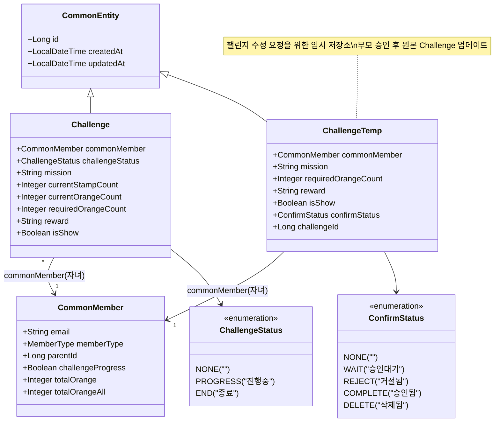
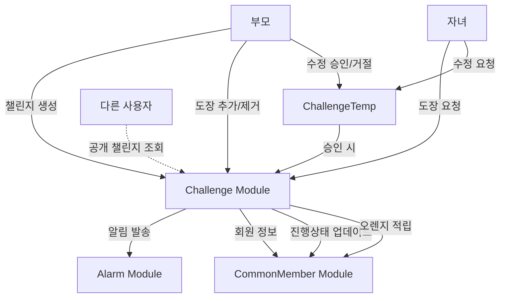
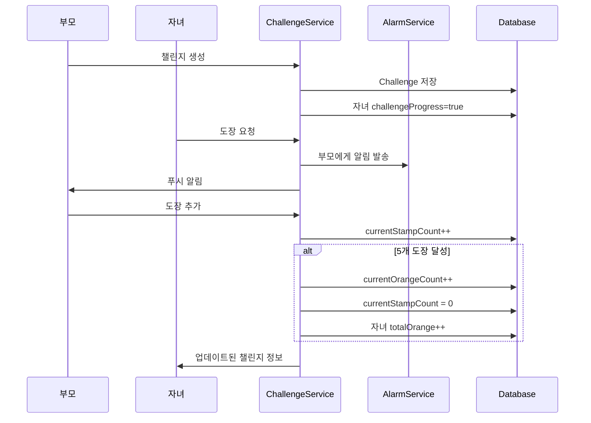
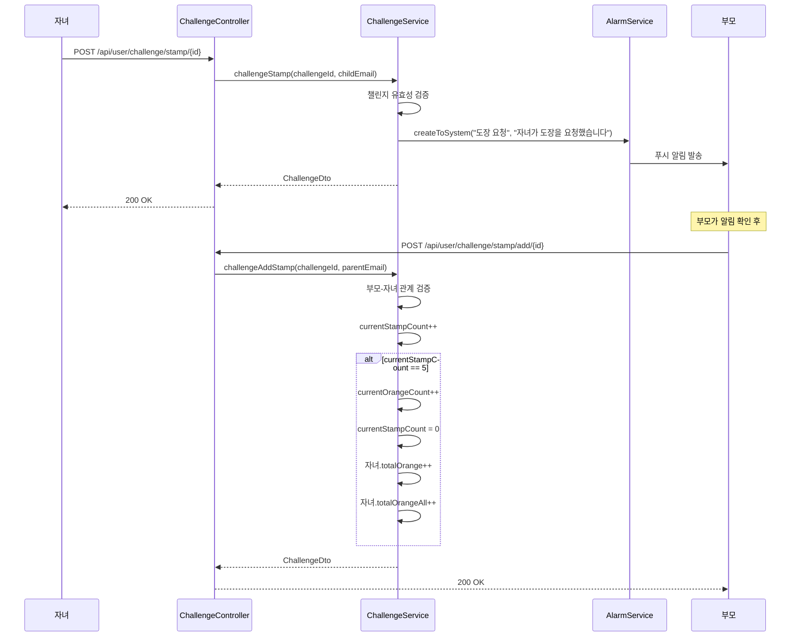
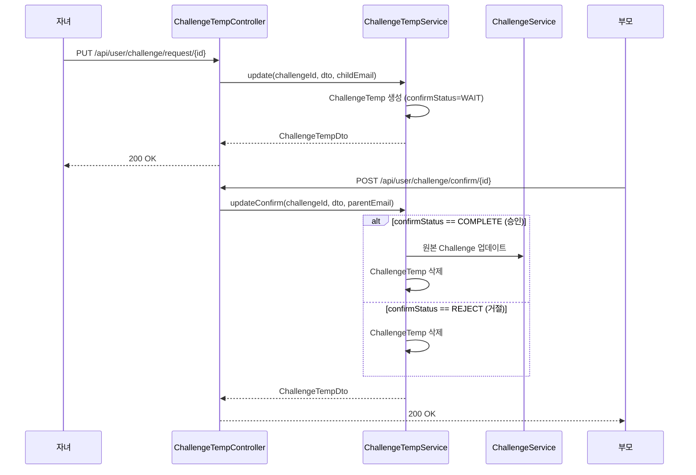

# Challenge 모듈 분석

## 1. 모듈이 담당하는 역할

Challenge 모듈은 오렌지스쿨의 핵심 게이미피케이션 시스템으로, 부모-자녀 간 교육적 상호작용을 촉진합니다:

- 부모가 자녀를 위한 미션(챌린지) 생성 및 관리
- 도장(스탬프) 시스템을 통한 진행도 추적
- 도장을 오렌지로 변환하는 보상 시스템 (5도장 = 1오렌지)
- 자녀의 챌린지 수정 요청에 대한 부모 승인 워크플로우
- 챌린지 공개/비공개 설정을 통한 프라이버시 제어
- 푸시 알림을 통한 실시간 상호작용

## 2. 도메인 객체 구조도



## 3. 모듈 연관성 분석

### 모듈 간 상호작용


### 데이터 흐름


## 4. 서비스에서 하는 일과 시퀀스 다이어그램

### 주요 서비스 메소드

#### ChallengeService
1. **create()**: 부모가 자녀를 위한 챌린지 생성
2. **challengeStamp()**: 자녀의 도장 요청 및 부모 알림
3. **challengeAddStamp()**: 부모의 도장 추가 (5개마다 오렌지 변환)
4. **challengeRemoveStamp()**: 부모의 도장 제거
5. **challengeComplete()**: 챌린지 완료 처리
6. **update()**: 챌린지 정보 수정
7. **delete()**: 챌린지 삭제

#### ChallengeTempService
1. **update()**: 자녀의 수정 요청 생성
2. **updateConfirm()**: 부모의 승인/거절 처리

### 도장 시스템 시퀀스 다이어그램



### 챌린지 수정 승인 워크플로우



## 5. 개선점

### 1. **트랜잭션 관리 강화**
```java
@Transactional(isolation = Isolation.SERIALIZABLE)
public ChallengeDto challengeAddStamp(Long challengeId, String userEmail) {
    // 동시 도장 추가 방지를 위한 격리 수준 설정
}
```

### 2. **도장 이력 추적**
```java
@Entity
public class StampHistory extends CommonEntity {
    @ManyToOne
    private Challenge challenge;
    
    @ManyToOne
    private CommonMember addedBy;
    
    private StampAction action;  // ADD, REMOVE
    private Integer stampCountBefore;
    private Integer stampCountAfter;
    private String reason;
}
```

### 3. **챌린지 템플릿 시스템**
```java
@Entity
public class ChallengeTemplate {
    private String title;
    private String missionTemplate;
    private Integer suggestedOrangeCount;
    private String category;  // 학습, 생활습관, 운동 등
    private Integer ageMin;
    private Integer ageMax;
}
```

### 4. **도장 제거 제약 조건 구현**
```java
public void validateStampRemoval(Challenge challenge) {
    LocalDateTime lastStampTime = getLastStampAddTime(challenge);
    if (lastStampTime.isBefore(LocalDateTime.now().minusHours(24))) {
        throw new CustomException(ResponseCode.STAMP_REMOVAL_TIME_EXCEEDED);
    }
}
```

### 5. **ChallengeTemp 자동 정리**
```java
@Scheduled(cron = "0 0 2 * * *")  // 매일 새벽 2시
public void cleanupAbandonedRequests() {
    LocalDateTime threshold = LocalDateTime.now().minusDays(7);
    challengeTempRepository.deleteByCreatedAtBeforeAndConfirmStatus(
        threshold, ConfirmStatus.WAIT
    );
}
```

### 6. **도장-오렌지 변환율 설정**
```java
@Entity
public class ChallengeConfig extends CommonEntity {
    private Integer stampsPerOrange = 5;  // 기본값
    private Boolean allowCustomRatio = false;
    
    @ManyToOne
    private CommonMember member;  // 회원별 커스텀 설정
}
```

### 7. **챌린지 통계 기능**
```java
public class ChallengeStatistics {
    private Double averageCompletionTime;
    private Integer totalChallengesCompleted;
    private Integer totalOrangesEarned;
    private Map<String, Integer> challengesByCategory;
    private List<Integer> stampProgressByDay;
}
```

### 8. **배지 시스템 도입**
```java
@Entity
public class Badge {
    private String name;
    private String description;
    private String imageUrl;
    private BadgeType type;  // CHALLENGE_COUNT, ORANGE_COUNT, STREAK
    private Integer requirement;
}
```

### 9. **챌린지 공유 기능**
```java
public class ChallengeShareDto {
    private String shareCode;
    private String shareUrl;
    private LocalDateTime expiresAt;
    
    public String generateShareLink(Challenge challenge) {
        String code = UUID.randomUUID().toString();
        // Redis에 임시 저장
        return "https://orangeschool.com/challenge/share/" + code;
    }
}
```

### 10. **알림 커스터마이징**
```java
public class ChallengeNotificationSettings {
    private Boolean notifyOnStampRequest = true;
    private Boolean notifyOnCompletion = true;
    private Boolean dailyProgressReminder = false;
    private LocalTime reminderTime = LocalTime.of(20, 0);
}
```