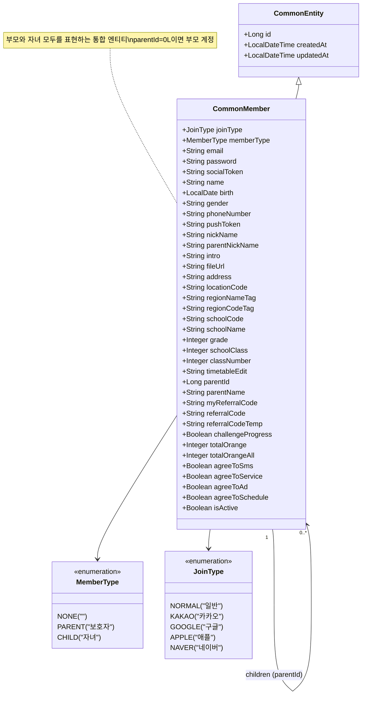
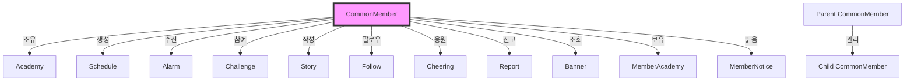
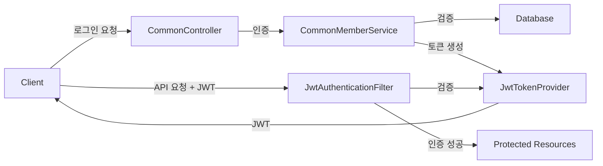
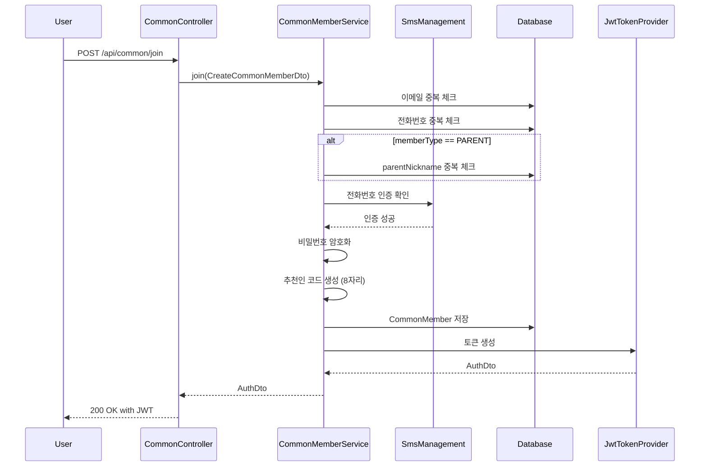
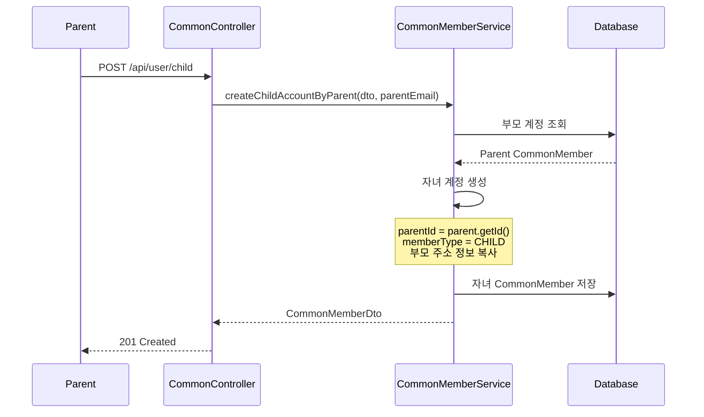
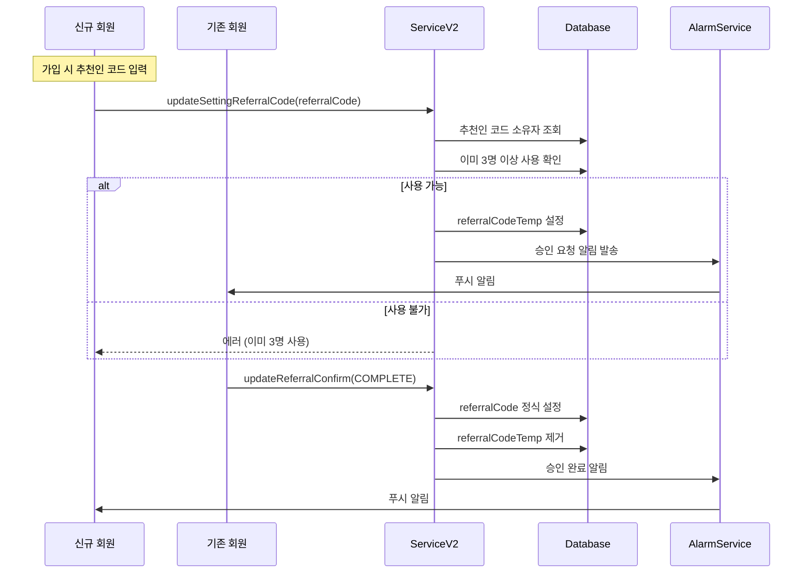

# CommonMember 모듈 분석

## 1. 모듈이 담당하는 역할

CommonMember 모듈은 오렌지스쿨 플랫폼의 핵심 사용자 관리 시스템으로, 다음과 같은 기능을 담당합니다:

- 부모/자녀 이중 계정 체계 관리
- 일반/소셜 로그인 인증 시스템
- 부모-자녀 계정 연결 및 관리
- 추천인 코드 시스템 운영
- 지역 기반 커뮤니티 (동네친구) 기능
- 프로필 및 학교 정보 관리
- 알림 설정 및 푸시 토큰 관리
- SMS 인증 시스템

## 2. 도메인 객체 구조도



## 3. 모듈 연관성 분석

### 중심 허브 역할


### 인증 및 보안 흐름


## 4. 서비스에서 하는 일과 시퀀스 다이어그램

### 주요 서비스 메소드

#### CommonMemberService (v1)
1. **join()**: 회원가입 (이메일/전화번호 검증)
2. **login()**: 일반 로그인
3. **socialLogin()**: 소셜 로그인
4. **findEmail()**: 이메일 찾기
5. **resetPassword()**: 비밀번호 재설정
6. **update()**: 프로필 업데이트
7. **createChildAccountByParent()**: 자녀 계정 생성

#### CommonMemberServiceV2
1. **updateSettingRegion()**: 지역 설정 업데이트
2. **updateParentNickname()**: 부모 닉네임 변경
3. **updateSettingReferralCode()**: 추천인 코드 요청
4. **updateReferralConfirm()**: 추천인 승인/거절
5. **checkReferralCode()**: 추천인 코드 유효성 검증

### 회원가입 시퀀스 다이어그램



### 부모-자녀 연결 시퀀스 다이어그램



### 추천인 코드 승인 워크플로우



## 5. 개선점

### 1. **엔티티 분리**
```java
// 현재: 하나의 거대한 엔티티
// 개선: 관심사별 분리
@Entity
public class MemberProfile {
    @OneToOne
    private CommonMember member;
    private String nickName;
    private String intro;
    private String fileUrl;
}

@Entity
public class MemberSchool {
    @OneToOne
    private CommonMember member;
    private String schoolCode;
    private String schoolName;
    private Integer grade;
}
```

### 2. **상속 구조 도입**
```java
@Entity
@Inheritance(strategy = InheritanceType.SINGLE_TABLE)
@DiscriminatorColumn(name = "memberType")
public abstract class CommonMember extends CommonEntity {
    // 공통 필드
}

@Entity
@DiscriminatorValue("PARENT")
public class ParentMember extends CommonMember {
    private String parentNickName;
    @OneToMany(mappedBy = "parent")
    private List<ChildMember> children;
}

@Entity
@DiscriminatorValue("CHILD")
public class ChildMember extends CommonMember {
    @ManyToOne
    private ParentMember parent;
    private MemberSchool school;
}
```

### 3. **매직 넘버 제거**
```java
// 현재: parentId = 0L은 부모를 의미
// 개선: Optional 사용
@Column
private Long parentId;  // null이면 부모

public Optional<Long> getParentId() {
    return Optional.ofNullable(parentId);
}
```

### 4. **추천인 코드 설정 분리**
```java
@Service
public class ReferralService {
    private static final int MAX_REFERRALS = 3;
    
    @Value("${referral.max-uses:3}")
    private int maxReferralUses;
    
    public void processReferral(CommonMember member, String referralCode) {
        // 추천인 로직 중앙화
    }
}
```

### 5. **이벤트 기반 아키텍처**
```java
@Component
public class MemberEventPublisher {
    @EventListener
    public void handleMemberCreated(MemberCreatedEvent event) {
        // 회원 생성 시 추천인 코드 생성
        // 웰컴 알림 발송
        // 통계 업데이트
    }
}
```

### 6. **검증 로직 분리**
```java
@Component
public class MemberValidator {
    public void validateParentNickname(String nickname) {
        // 부모 닉네임 검증 규칙
    }
    
    public void validateSchoolInfo(MemberSchoolDto school) {
        // 학교 정보 검증 규칙
    }
}
```

### 7. **쿼리 최적화**
```java
@Query("SELECT m FROM CommonMember m " +
       "LEFT JOIN FETCH m.challenges " +
       "LEFT JOIN FETCH m.schedules " +
       "WHERE m.id = :id")
CommonMember findByIdWithDetails(@Param("id") Long id);
```

### 8. **캐싱 전략**
```java
@Cacheable(value = "memberProfile", key = "#email")
public CommonMemberProfileDto getProfile(String email) {
    // 자주 조회되는 프로필 정보 캐싱
}
```

### 9. **소셜 로그인 통합**
```java
@Component
public class SocialLoginAdapter {
    private Map<JoinType, SocialLoginProvider> providers;
    
    public AuthDto authenticate(JoinType type, String token) {
        return providers.get(type).authenticate(token);
    }
}
```

### 10. **감사 로그**
```java
@EntityListeners(AuditingEntityListener.class)
public class CommonMember extends CommonEntity {
    @CreatedBy
    private String createdBy;
    
    @LastModifiedBy
    private String modifiedBy;
    
    @Version
    private Long version;  // 낙관적 잠금
}
```