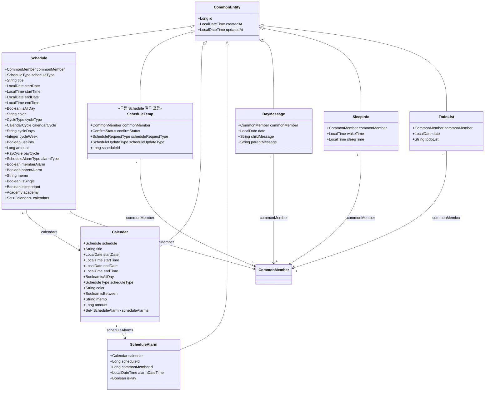
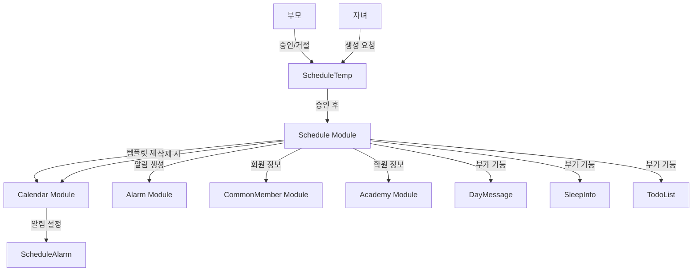
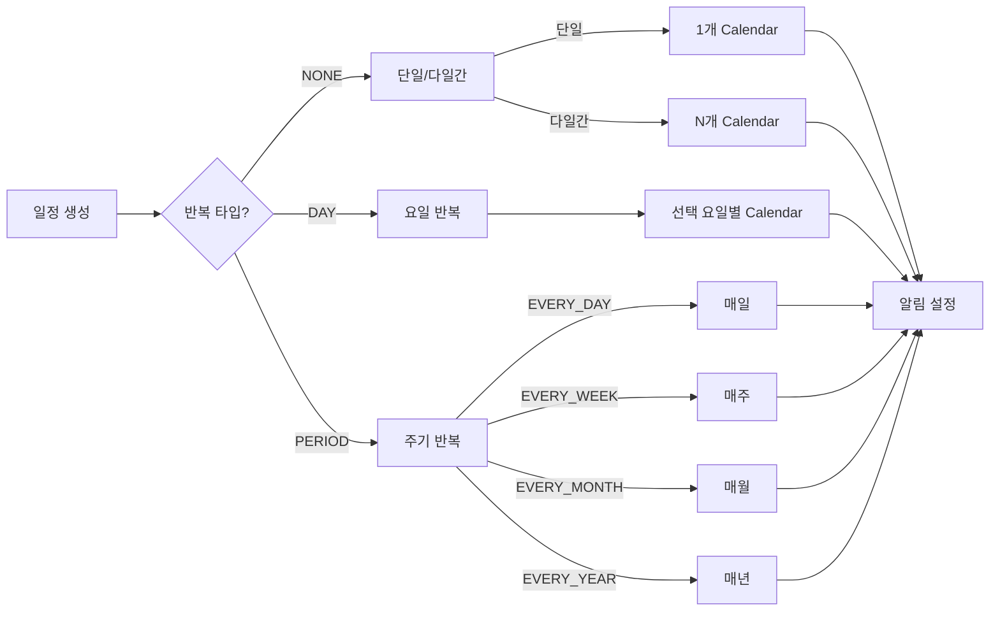
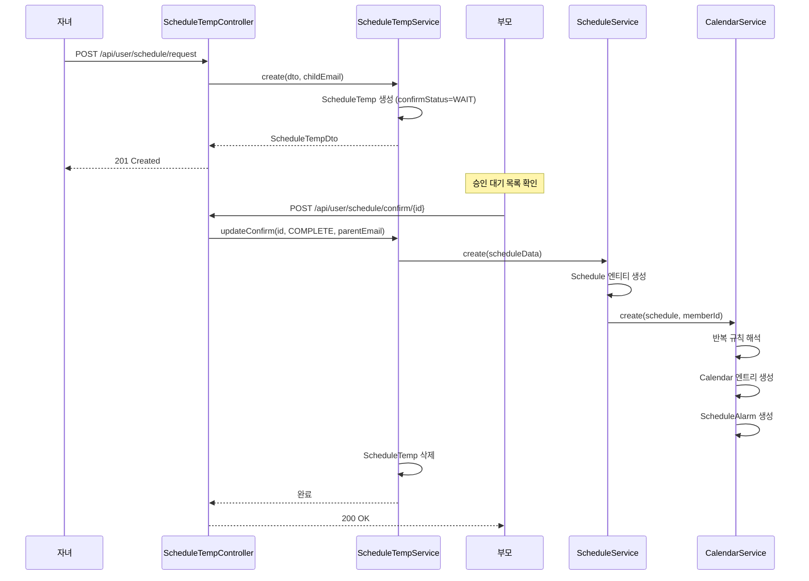
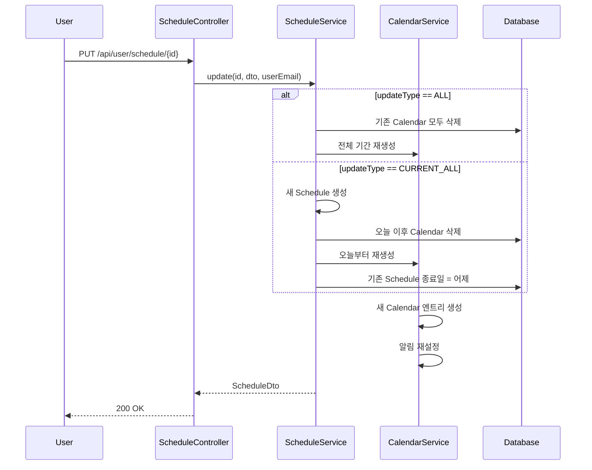
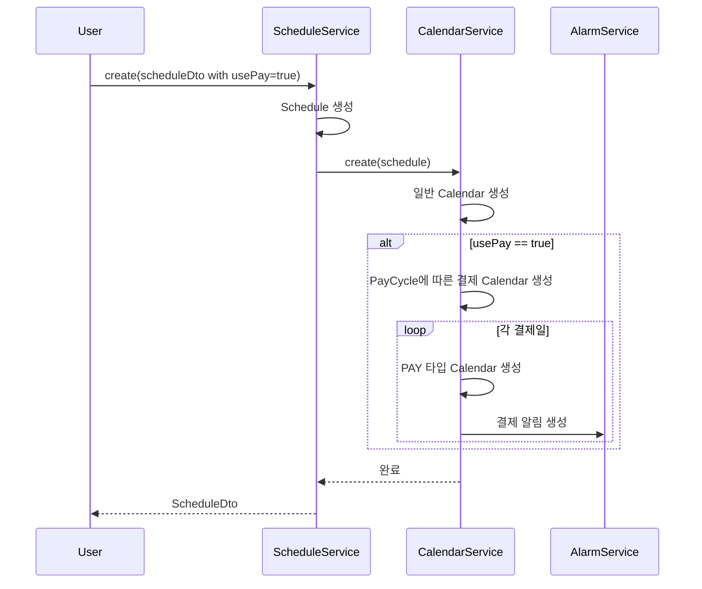

# Schedule 모듈 분석

## 1. 모듈이 담당하는 역할

Schedule 모듈은 오렌지스쿨의 종합적인 일정 관리 시스템으로, 다음과 같은 기능을 담당합니다:

- 학원, 학교, 차량, 병원 등 다양한 유형의 일정 생성 및 관리
- 단일, 반복, 다일간 일정 지원 (일/주/월/년 단위)
- 결제 일정 관리 및 주기적 결제 추적
- 부모-자녀 일정 승인 워크플로우
- 일정별 알림 설정 (부모/자녀 개별 설정)
- 하루 메시지, 수면 정보, 할 일 목록 등 부가 기능
- Calendar 모듈과 연동하여 실제 캘린더 이벤트 생성

## 2. 도메인 객체 구조도



## 3. 모듈 연관성 분석

### 모듈 간 협업 구조


### 일정 타입별 처리 흐름


## 4. 서비스에서 하는 일과 시퀀스 다이어그램

### 주요 서비스 메소드

#### ScheduleService
1. **create()**: 일정 생성 및 캘린더 엔트리 생성
2. **update()**: 일정 수정 (전체/현재 이후)
3. **delete()**: 일정 삭제 (개별 캘린더/전체)
4. **getSchedulesGroupedByScheduleType()**: 타입별 일정 조회
5. **createDayMessage()**: 하루 메시지 생성
6. **createOrUpdateSleepInfo()**: 수면 정보 관리
7. **createOrUpdateTodoList()**: 할 일 목록 관리

#### ScheduleTempService
1. **create()**: 자녀의 일정 생성 요청
2. **update()**: 자녀의 일정 수정 요청
3. **updateConfirm()**: 부모의 승인/거절 처리

### 일정 생성 승인 워크플로우



### 반복 일정 업데이트 시퀀스



### 결제 일정 처리



## 5. 개선점

### 1. **ScheduleTemp 자동 정리**
```java
@Scheduled(cron = "0 0 3 * * *")
public void cleanupExpiredScheduleRequests() {
    LocalDateTime expiry = LocalDateTime.now().minusDays(30);
    scheduleTempRepository.deleteByCreatedAtBeforeAndConfirmStatus(
        expiry, ConfirmStatus.WAIT
    );
}
```

### 2. **소프트 삭제 구현**
```java
@Entity
public class Schedule extends CommonEntity {
    @Column
    private Boolean isDeleted = false;
    
    @Column
    private LocalDateTime deletedAt;
    
    @Column
    private String deletedBy;
}
```

### 3. **TodoList 정규화**
```java
@Entity
public class TodoItem extends CommonEntity {
    @ManyToOne
    private TodoList todoList;
    
    private String content;
    private Boolean isCompleted;
    private Integer orderIndex;
}
```

### 4. **일정 충돌 검사**
```java
public boolean hasScheduleConflict(Schedule newSchedule) {
    List<Calendar> conflicts = calendarRepository.findOverlapping(
        newSchedule.getCommonMember().getId(),
        newSchedule.getStartDateTime(),
        newSchedule.getEndDateTime()
    );
    return !conflicts.isEmpty();
}
```

### 5. **일정 템플릿 기능**
```java
@Entity
public class ScheduleTemplate {
    private String name;
    private ScheduleType type;
    private String defaultTitle;
    private String defaultColor;
    private Duration defaultDuration;
    private CycleType suggestedCycle;
}
```

### 6. **알림 삭제 코드 복원**
```java
// 현재 주석 처리된 알림 삭제 로직 복원
private void deleteScheduleAlarms(List<Calendar> calendars) {
    calendars.forEach(calendar -> {
        scheduleAlarmRepository.deleteAllByCalendar(calendar);
    });
}
```

### 7. **업데이트 전략 개선**
```java
// CURRENT_ALL 업데이트 시 새 Schedule 생성 대신 기존 수정
public void updateFromDate(Schedule schedule, LocalDate fromDate) {
    // 기존 Calendar만 수정
    List<Calendar> futureCalendars = calendarRepository
        .findByScheduleAndStartDateAfter(schedule, fromDate);
    
    futureCalendars.forEach(calendar -> {
        updateCalendarFromSchedule(calendar, schedule);
    });
}
```

### 8. **일정 동기화**
```java
public interface ScheduleSyncService {
    void syncWithGoogleCalendar(CommonMember member);
    void importFromICS(MultipartFile icsFile, CommonMember member);
    void exportToICS(List<Schedule> schedules);
}
```

### 9. **일정 공유 기능**
```java
@Entity
public class ScheduleShare {
    @ManyToOne
    private Schedule schedule;
    
    @ManyToOne
    private CommonMember sharedWith;
    
    private SharePermission permission;  // VIEW, EDIT
    private LocalDateTime expiresAt;
}
```

### 10. **성능 최적화**
```java
// N+1 문제 해결
@Query("SELECT s FROM Schedule s " +
       "LEFT JOIN FETCH s.calendars " +
       "LEFT JOIN FETCH s.academy " +
       "WHERE s.commonMember.id = :memberId")
List<Schedule> findByMemberIdWithDetails(@Param("memberId") Long memberId);
```