# Orange School API Server 도메인 분석

## 1. 개요

이 문서는 Orange School API Server의 도메인 구조와 도메인 간 의존성을 분석한 결과를 담고 있습니다. 각 도메인의 역할과 책임을 명확히 하고, 도메인 간의 의존 관계를 시각화하여 시스템의 아키텍처를 이해하는 데 도움을 주고자 합니다.

## 2. 도메인 구조 개요

Orange School은 부모와 자녀가 함께 사용하는 일정 관리 및 교육 플랫폼으로, 다음과 같은 주요 도메인으로 구성되어 있습니다:

### 2.1 핵심 도메인
- **CommonMember**: 부모/자녀 회원 관리 (시스템의 중심 도메인)
- **Schedule**: 일정 관리
- **Academy**: 학원 정보 관리
- **Challenge**: 부모-자녀 간 도전 과제

### 2.2 커뮤니티 도메인
- **Story**: 커뮤니티 게시물
- **Pick**: 매거진 콘텐츠

### 2.3 지원 도메인
- **Alarm/MemberAlarm**: 알림 시스템
- **Calendar**: 캘린더 뷰 생성
- **Location**: 위치 정보
- **Manager**: 관리자 계정

## 3. 도메인별 상세 분석

### 3.1 CommonMember (일반 회원)
**역할**: 부모와 자녀 회원의 정보를 관리하는 핵심 도메인

**주요 기능**:
- 회원 가입/로그인 (일반, 소셜)
- 프로필 관리
- 자녀 계정 연결
- 추천인 코드 시스템
- 지역 설정 및 시간표 관리

**의존 관계**:
- → LocationService: 지역 정보 조회
- → MemberAlarmService: 회원 관련 알림 전송
- → FileManagement: 프로필 이미지 처리
- → SmsManagement: SMS 인증

### 3.2 Schedule (일정)
**역할**: 다양한 유형의 일정을 관리하는 도메인

**주요 기능**:
- 학원 일정 관리
- 결제 일정 관리
- 개인 일정 관리
- 반복 일정 설정
- 일정 승인 요청 (ScheduleTemp)

**의존 관계**:
- → CommonMemberRepository: 일정 소유자 정보
- → AcademyRepository: 학원 일정 정보
- → MemberAcademyRepository: 학원-회원 연결
- → CalendarService: 캘린더 데이터 생성
- → ScheduleAlarmService: 일정 알림 설정
- → MemberAlarmService: 알림 전송

**문제점**: 다른 도메인의 Repository를 직접 참조하여 높은 결합도

### 3.3 Academy (학원)
**역할**: 학원 정보를 관리하는 도메인

**주요 기능**:
- 학원 등록/수정
- 학원 검색
- 관리자/일반 회원의 학원 등록

**의존 관계**:
- → CommonMemberRepository: 학원 등록 회원
- → ManagerRepository: 학원 등록 관리자

### 3.4 Challenge (챌린지)
**역할**: 부모가 자녀에게 주는 도전 과제 관리

**주요 기능**:
- 챌린지 생성/수정
- 도장 시스템 (5개 = 오렌지 1개)
- 챌린지 승인 (ChallengeTemp)

**의존 관계**:
- → CommonMember: 부모/자녀 정보
- → MemberAlarmService: 챌린지 알림

### 3.5 Story (스토리)
**역할**: 커뮤니티 게시물 관리

**주요 기능**:
- 게시물 작성/수정/삭제
- 댓글/대댓글
- 좋아요
- 지역 태그

**의존 관계**:
- → CommonMember: 작성자 정보
- → FileManagement: 이미지 업로드

### 3.6 Pick (매거진)
**역할**: 관리자가 작성하는 매거진 콘텐츠

**주요 기능**:
- 매거진 작성/수정
- 댓글/대댓글
- 좋아요

**의존 관계**:
- → Manager: 작성자 (관리자)
- → FileManagement: 이미지 관리

## 4. 도메인 의존성 다이어그램

### 4.1 전체 도메인 의존성 그래프

```mermaid
graph TD
    %% 핵심 도메인
    CommonMember[CommonMember<br/>일반 회원]
    Schedule[Schedule<br/>일정]
    Academy[Academy<br/>학원]
    Challenge[Challenge<br/>챌린지]
    
    %% 커뮤니티 도메인
    Story[Story<br/>스토리]
    Pick[Pick<br/>매거진]
    
    %% 지원 도메인
    Alarm[Alarm<br/>알림]
    MemberAlarm[MemberAlarm<br/>회원 알림]
    Calendar[Calendar<br/>캘린더]
    Location[Location<br/>위치]
    Manager[Manager<br/>관리자]
    
    %% 연결 도메인
    MemberAcademy[MemberAcademy<br/>회원-학원]
    ScheduleAlarm[ScheduleAlarm<br/>일정 알림]
    Follow[Follow<br/>팔로우]
    
    %% 기타 도메인
    Report[Report<br/>신고]
    Banner[Banner/V2<br/>배너]
    Popup[Popup<br/>팝업]
    Notice[Notice<br/>공지사항]
    
    %% 의존 관계
    CommonMember --> Location
    CommonMember --> MemberAlarm
    
    Schedule --> CommonMember
    Schedule --> Academy
    Schedule --> MemberAcademy
    Schedule --> Calendar
    Schedule --> ScheduleAlarm
    Schedule --> MemberAlarm
    
    Academy --> CommonMember
    Academy --> Manager
    
    Challenge --> CommonMember
    Challenge --> MemberAlarm
    
    Story --> CommonMember
    Pick --> Manager
    
    Calendar --> CommonMember
    Calendar --> ScheduleAlarm
    
    MemberAcademy --> CommonMember
    MemberAcademy --> Academy
    
    Follow --> CommonMember
    
    Report --> CommonMember
    Report --> Story
    Report --> Pick
    
    Alarm --> MemberAlarm
    
    %% 스타일링
    classDef core fill:#440000,stroke:#333,stroke-width:3px
    classDef community fill:#002244,stroke:#333,stroke-width:2px
    classDef support fill:#004400,stroke:#333,stroke-width:2px
    classDef other fill:#442200,stroke:#333,stroke-width:1px
    
    class CommonMember,Schedule,Academy,Challenge core
    class Story,Pick community
    class Alarm,MemberAlarm,Calendar,Location,Manager support
    class Report,Banner,Popup,Notice,MemberAcademy,ScheduleAlarm,Follow other
```



### 4.2 핵심 도메인 간 상세 의존성

```mermaid
graph LR
    subgraph "Schedule Domain"
        ScheduleService[ScheduleService]
        ScheduleRepo[ScheduleRepository]
    end
    
    subgraph "CommonMember Domain"
        CMService[CommonMemberService]
        CMRepo[CommonMemberRepository]
    end
    
    subgraph "Academy Domain"
        AcademyService[AcademyService]
        AcademyRepo[AcademyRepository]
    end
    
    subgraph "MemberAcademy Domain"
        MARepo[MemberAcademyRepository]
    end
    
    subgraph "Calendar Domain"
        CalendarService[CalendarService]
    end
    
    subgraph "MemberAlarm Domain"
        MAService[MemberAlarmService]
    end
    
    %% 문제가 되는 의존성 (Repository 직접 참조)
    ScheduleService -.->|직접 참조<br/>❌ 위반| CMRepo
    ScheduleService -.->|직접 참조<br/>❌ 위반| AcademyRepo
    ScheduleService -.->|직접 참조<br/>❌ 위반| MARepo
    
    %% 올바른 의존성 (Service 간 통신)
    ScheduleService -->|✅ 올바름| CalendarService
    ScheduleService -->|✅ 올바름| MAService
    
    AcademyService -.->|직접 참조<br/>❌ 위반| CMRepo
    
    %% 스타일링
    style ScheduleService fill:#440000
    style AcademyService fill:#440000
    style CMRepo fill:#442222
    style AcademyRepo fill:#442222
    style MARepo fill:#442222
```



### 4.3 알림 시스템 의존성

```mermaid
graph TD
    subgraph "알림 발생 도메인들"
        Schedule[Schedule<br/>일정]
        Challenge[Challenge<br/>챌린지]
        CommonMember[CommonMember<br/>회원]
    end
    
    subgraph "알림 시스템"
        Alarm[Alarm<br/>알림 마스터]
        MemberAlarmService[MemberAlarmService<br/>회원 알림 서비스]
        MemberAlarm[MemberAlarm<br/>회원별 알림]
        Push[PushMessageManagement<br/>푸시 전송]
    end
    
    Schedule --> MemberAlarmService
    Challenge --> MemberAlarmService
    CommonMember --> MemberAlarmService
    
    Alarm --> MemberAlarmService
    MemberAlarmService --> MemberAlarm
    MemberAlarmService --> Push
    
    %% 스타일링
    style MemberAlarmService fill:#224422,stroke:#333,stroke-width:3px
```



## 5. 의존성 문제점 및 개선 방안

### 5.1 현재 문제점

#### 1) Repository 직접 참조
여러 Service에서 다른 도메인의 Repository를 직접 주입받아 사용하고 있습니다:

- **ScheduleService**: CommonMemberRepository, AcademyRepository, MemberAcademyRepository 직접 참조
- **AcademyService**: CommonMemberRepository, ManagerRepository 직접 참조
- **ReportService**: StoryRepository, PickCommentRepository 등 직접 참조

이는 도메인 간 결합도를 높이고 단일 책임 원칙을 위반합니다.

#### 2) 순환 의존 가능성
현재는 명시적인 순환 의존은 없으나, Repository 직접 참조로 인해 향후 순환 의존이 발생할 위험이 있습니다.

### 5.2 개선 방안

#### 1) Service Layer를 통한 도메인 간 통신
```java
// ❌ 현재 (문제)
@Service
public class ScheduleService {
    @Autowired
    private CommonMemberRepository commonMemberRepository;  // 직접 참조
    
    public void createSchedule() {
        CommonMember member = commonMemberRepository.findById(id);  // 직접 사용
    }
}

// ✅ 개선안
@Service
public class ScheduleService {
    @Autowired
    private CommonMemberService commonMemberService;  // Service 참조
    
    public void createSchedule() {
        CommonMemberDto member = commonMemberService.getMemberInfo(id);  // Service 통해 접근
    }
}
```

#### 2) 도메인 간 인터페이스 정의
```java
// 도메인 간 통신용 인터페이스
public interface MemberInfoProvider {
    MemberBasicInfo getMemberBasicInfo(Long memberId);
    boolean existsMember(Long memberId);
}

// CommonMemberService에서 구현
@Service
public class CommonMemberService implements MemberInfoProvider {
    // 구현...
}
```

#### 3) 이벤트 기반 아키텍처 도입
특히 알림 시스템의 경우:
```java
// 이벤트 정의
public class ScheduleCreatedEvent {
    private Long scheduleId;
    private Long memberId;
    private LocalDateTime scheduleTime;
}

// 이벤트 발행
@Service
public class ScheduleService {
    @Autowired
    private ApplicationEventPublisher eventPublisher;
    
    public void createSchedule() {
        // 일정 생성 로직...
        eventPublisher.publishEvent(new ScheduleCreatedEvent(...));
    }
}

// 이벤트 처리
@Component
public class ScheduleAlarmEventHandler {
    @EventListener
    public void handleScheduleCreated(ScheduleCreatedEvent event) {
        // 알림 생성 로직...
    }
}
```

## 6. 도메인 분리 시 모듈 구조

만약 각 도메인을 독립적인 모듈로 분리한다면 다음과 같은 구조를 권장합니다:

```
orangeschool-api-server/
├── core-domain/              # 핵심 공통 도메인
│   ├── common-member/
│   └── common-interfaces/    # 도메인 간 인터페이스
├── business-domain/          # 비즈니스 도메인
│   ├── schedule/
│   ├── academy/
│   ├── challenge/
│   └── calendar/
├── community-domain/         # 커뮤니티 도메인
│   ├── story/
│   └── pick/
├── support-domain/           # 지원 도메인
│   ├── alarm/
│   ├── location/
│   └── file-management/
└── api-application/          # API 조합 레이어
    └── controllers/
```

### 모듈 간 의존성 규칙:
1. 하위 레벨은 상위 레벨을 참조할 수 없음
2. 동일 레벨 간에는 인터페이스를 통해서만 통신
3. 공통 기능은 core-domain에 배치

## 7. 결론

Orange School API Server는 도메인 중심의 패키지 구조를 가지고 있으나, 일부 도메인에서 다른 도메인의 Repository를 직접 참조하는 문제가 있습니다. 이를 개선하기 위해:

1. **단기 개선**: Repository 직접 참조를 Service를 통한 참조로 변경
2. **중기 개선**: 도메인 간 명확한 인터페이스 정의
3. **장기 개선**: 이벤트 기반 아키텍처 도입으로 느슨한 결합 구현

이러한 개선을 통해 각 도메인의 독립성을 높이고, 유지보수성과 확장성을 향상시킬 수 있을 것입니다.