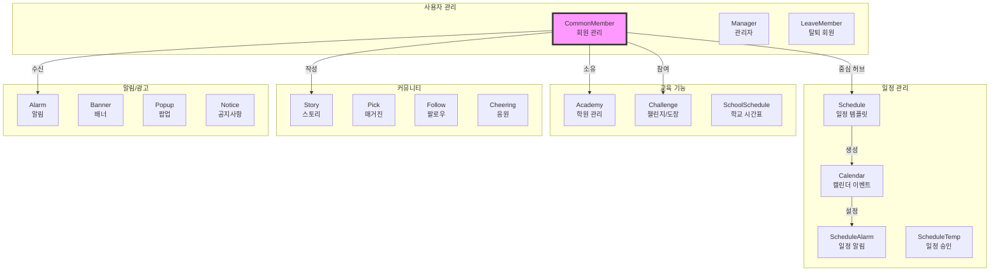
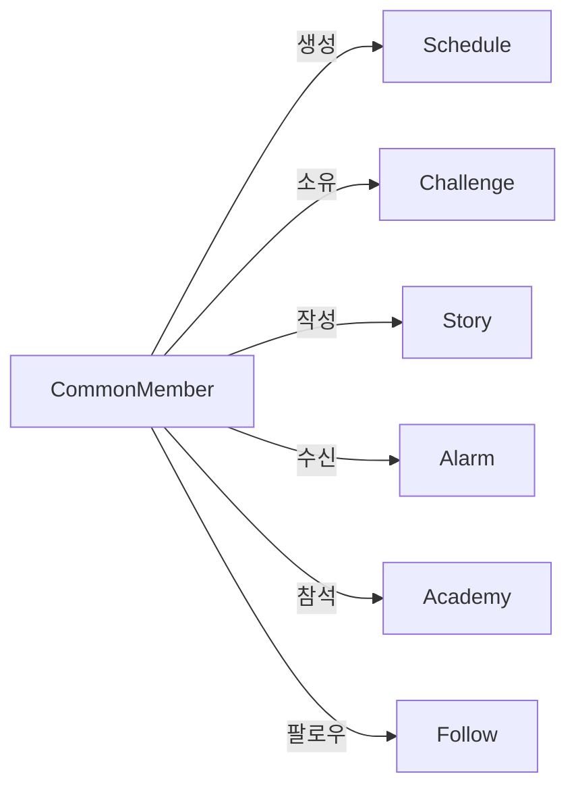
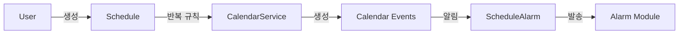
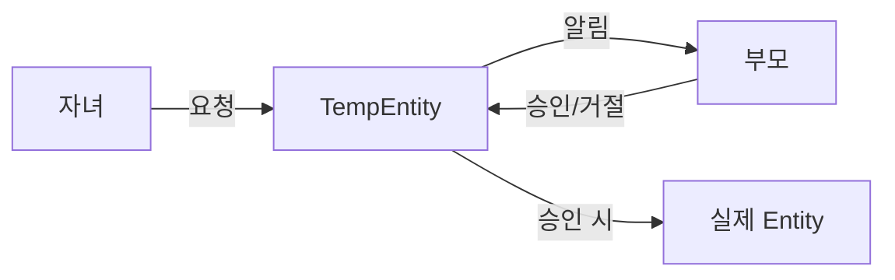

# 오렌지스쿨 API 서버 모듈 전체 요약

## 시스템 개요

오렌지스쿨은 부모와 자녀 간의 교육적 상호작용을 촉진하는 종합 교육 플랫폼입니다. 도메인 주도 설계(DDD) 패턴을 따르며, 23개의 독립적인 도메인 모듈로 구성되어 있습니다.

## 핵심 모듈 구조도

## 주요 모듈별 역할 및 특징

### 1. **CommonMember (회원 관리)**
- **역할**: 부모/자녀 통합 회원 관리 시스템
- **주요 기능**:
  - 일반/소셜(카카오, 구글, 애플, 네이버) 로그인
  - 부모-자녀 계정 연결 (추천인 코드 시스템)
  - 지역 기반 커뮤니티 (동네친구)
  - JWT 기반 인증
- **개선 필요**: 엔티티 크기가 너무 크므로 관심사별 분리 필요

### 2. **Schedule & Calendar (일정 관리)**
- **역할**: 종합적인 일정 관리 시스템
- **주요 기능**:
  - Schedule: 일정 템플릿 (반복 규칙, 알림 설정)
  - Calendar: 실제 캘린더 이벤트 (Schedule로부터 생성)
  - 다양한 일정 유형 (학원, 학교, 차량, 병원, 결제 등)
  - 복잡한 반복 패턴 지원
- **특징**: 부모 승인 워크플로우 (ScheduleTemp)

### 3. **Challenge (챌린지 시스템)**
- **역할**: 게이미피케이션을 통한 교육 동기부여
- **주요 기능**:
  - 부모가 자녀에게 미션 부여
  - 도장 시스템 (5도장 = 1오렌지)
  - 보상 체계 및 진행도 추적
- **특징**: 자녀의 수정 요청에 대한 부모 승인 필요

### 4. **Academy (학원 관리)**
- **역할**: 교육 기관 정보 관리
- **주요 기능**:
  - 학원 정보 CRUD
  - 회원-학원 다대다 관계 (MemberAcademy)
  - 지역별 검색 및 필터링
- **문제점**: MemberAcademy 연결 기능 미완성

### 5. **Alarm (알림 시스템)**
- **역할**: 플랫폼 전체 알림 관리
- **주요 기능**:
  - 광고성/서비스/시스템/일정 알림
  - 부모/자녀별 타겟팅
  - FCM 푸시 알림 연동
- **문제점**: 데이터 중복 (MemberAlarm에 내용 복사)

### 6. **Banner (배너 광고)**
- **버전**: v1 (Location 기반) → v2 (태그 기반)
- **v2 개선사항**:
  - 유연한 지역 타겟팅
  - 조회수 추적
  - 활성화 상태 관리
  - 페이징 및 검색
- **권장**: v1 폐기 및 v2로 완전 마이그레이션

### 7. **Story & Pick (소셜 콘텐츠)**
- **역할**: 커뮤니티 콘텐츠 플랫폼
- **공통 기능**:
  - 좋아요, 댓글, 대댓글
  - 조회수 추적
  - 지역 기반 필터링
  - 신고 시스템

## 모듈 간 주요 상호작용

### 1. **회원 중심 아키텍처**

### 2. **일정 생성 플로우**

### 3. **승인 워크플로우**

## 공통 패턴 및 아키텍처

### 1. **기술 스택**
- Spring Boot + JPA/Hibernate
- QueryDSL for 복잡한 쿼리
- JWT 기반 인증
- Firebase Cloud Messaging
- Redis (캐싱/세션)

### 2. **디자인 패턴**
- Repository Pattern with Custom Implementation
- DTO Pattern (Request/Response 분리)
- Builder Pattern
- Template Method Pattern (Schedule → Calendar)

### 3. **공통 개선 사항**
1. **트랜잭션 관리**: 명시적 트랜잭션 경계 설정 필요
2. **캐싱 전략**: 자주 조회되는 데이터에 대한 캐싱 부재
3. **페이징**: 일부 조회 API에 페이징 미지원
4. **소프트 삭제**: 하드 삭제로 인한 데이터 손실 위험
5. **N+1 문제**: Lazy Loading으로 인한 성능 이슈

## 시스템 전체 개선 제안

### 1. **마이크로서비스 분리 고려**
- 현재 모놀리식 구조를 기능별 마이크로서비스로 분리
- 예: 회원 서비스, 일정 서비스, 커뮤니티 서비스

### 2. **이벤트 기반 아키텍처**
- 모듈 간 결합도 감소를 위한 이벤트 버스 도입
- 비동기 처리 및 확장성 개선

### 3. **API 버저닝**
- 현재 v1/v2가 혼재된 상황
- 통일된 API 버저닝 전략 수립

### 4. **모니터링 및 로깅**
- 분산 추적 시스템 도입
- 성능 메트릭 수집 및 분석

### 5. **테스트 커버리지**
- 단위 테스트 및 통합 테스트 확대
- API 문서 자동화 (Swagger 활용)

## 결론

오렌지스쿨 API 서버는 부모-자녀 교육 플랫폼으로서 필요한 핵심 기능들을 잘 구현하고 있습니다. 도메인 주도 설계를 따르는 명확한 모듈 구조를 가지고 있으나, 일부 모듈의 복잡도 관리와 성능 최적화가 필요합니다. 특히 CommonMember 모듈의 책임 분산과 캐싱 전략 도입이 시급하며, 장기적으로는 마이크로서비스 아키텍처로의 전환을 고려해볼 만합니다.